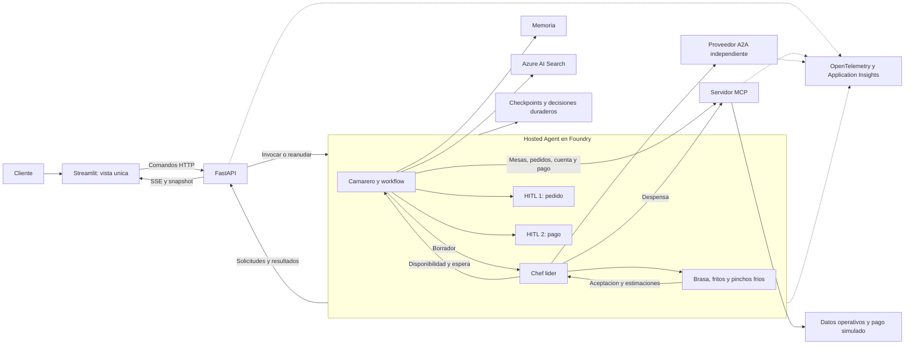

# Plan de implementacion: demo empresarial del restaurante multiagente

## 1. Objetivo, alcance y fuente de verdad

Implementar [SPECS.md](SPECS.md) como una unica aplicacion incremental.
El restaurante es el hilo narrativo para mostrar capacidades empresariales:
identidad, memoria gobernada, conocimiento con fuentes, herramientas con permisos,
orquestacion, interoperabilidad, control humano, transacciones y observabilidad.

El recorrido se completa en una sola vista y con un unico actor, el cliente:

`identificarse -> entrar -> solicitar mesa -> pedir -> consultar cocina ->
confirmar pedido (HITL 1) -> recibir -> solicitar cuenta ->
autorizar pago (HITL 2) -> pagar -> solicitar liberacion de mesa`

El camarero habla exclusivamente con el chef lider para resolver cocina.
El chef valida disponibilidad, consulta a los especialistas y devuelve una
propuesta consolidada con espera estimada. El camarero la comunica, no inventa
stock ni calcula tiempos de cocina.

Este documento es un plan, no una implementacion ni una autorizacion para
provisionar, desplegar o realizar cobros. Cada fase se implementa y valida cuando
se solicite. Se utilizan datos sinteticos, preparacion simulada y pagos simulados.
La planificacion parte de cero: todas las fases estan pendientes, incluidas la
creacion del camarero y la memoria. No se presupone codigo, recursos o pruebas
ya realizados. Esto no implica borrar los archivos o recursos actuales.

### Cambios respecto al plan anterior

- Se conserva el stack tecnologico; cambia la experiencia y el orden de entrega.
- La web aparece al principio, no al final: una vista Streamlit de cliente.
- No hay operador, paneles por rol ni recogida/limpieza de mesas.
- Los dos HITL pertenecen al cliente: pedido y pago, gestionados por el camarero.
- La liberacion la solicita el cliente despues de un pago confirmado.
- A2A conecta al chef con un proveedor independiente, no con fritura.
- La reposicion no tiene HITL; no se anade una tercera aprobacion.
- La observabilidad y los controles empresariales se introducen con cada efecto,
  no como una capa ornamental al terminar.

## 2. Stack elegido: se mantiene

| Capa | Tecnologia y destino |
|---|---|
| Lenguaje y contratos | Python y Pydantic; dependencias compatibles fijadas en un lockfile desde fase 1 |
| Agentes y workflow | Microsoft Agent Framework; workflow explicito, secuencial y concurrente donde corresponda |
| Modelo | `gpt-5.6-luna` en Microsoft Foundry; modelo elegido, con acceso y deployment por configurar y validar en fase 1 |
| Hosting final del workflow | Hosted Agent en Microsoft Foundry, incluyendo camarero, chef y los tres especialistas |
| Interfaz | Streamlit en Python, una unica vista de cliente |
| API/BFF | FastAPI; comandos HTTP, eventos SSE y consulta de snapshot |
| Conocimiento | Azure AI Search; carta diaria versionada, recuperacion con fuentes y busqueda vectorial/hibrida |
| Datos locales | SQLite para desarrollo; adaptadores separados de memoria, negocio, eventos y checkpoints |
| Datos compartidos en Azure | Cosmos DB; persistencia separada por responsabilidad y adaptador de checkpoints validado expresamente |
| Herramientas | Servidor MCP propio con servicios de negocio deterministas |
| Agente externo | Proveedor independiente accesible mediante A2A |
| Hosting auxiliar | Azure Container Apps para Streamlit/FastAPI, MCP y proveedor A2A |
| Empaquetado y CI | Cada componente ejecutable aporta su `Dockerfile` y un workflow de GitHub Actions de ruta acotada que valida, construye y publica su imagen |
| Identidad | Nombre de entrada normalizado y sesión de demo en el BFF para aislar recursos simulados; managed/agent identities solo entre servicios Azure |
| Observabilidad | Eventos de dominio, OpenTelemetry y Application Insights |
| Automatizacion | azd, infraestructura declarativa preferentemente Bicep y scripts Bash |

No se introduce React/Next.js, otro framework de agentes ni otro destino para
el workflow final. La compatibilidad concreta de SDK, protocolo de hosting,
checkpoints y transporte SSE se valida antes de depender de ella.

### Streamlit, HTTP y SSE

Streamlit tiene ejecucion Python en servidor: no se presupone que el navegador
consuma SSE directamente. Su adaptador de sesion consume el contrato HTTP/SSE
del BFF y actualiza la misma vista mediante mecanismos compatibles con la
version instalada. La fase 3 debe probar reconexion y reruns sin duplicar
suscripciones ni comandos. No se sustituira SSE silenciosamente por sondeo.

El navegador no recibe credenciales de Foundry ni acceso directo a MCP/A2A.
El BFF no ejecuta una segunda copia del workflow en el despliegue final.

## 3. Punto de partida y reglas de construccion

La fuente funcional es SPECS y la fuente tecnologica es el stack de la seccion 2.
El plan es autocontenido: no depende de fases antiguas, decisiones historicas
ni evidencias de una implementacion previa.

- Crear primero proyecto, configuracion, contratos, pruebas y camarero; despues
  incorporar memoria, interfaz y el resto de capacidades.
- Verificar acceso, disponibilidad y coste antes de crear recursos. Empezar de
  cero el plan no autoriza duplicar infraestructura compartida.
- No marcar una fase completada por encontrar codigo similar: debe satisfacer
  los criterios de esta especificacion y aportar su propia evidencia.
- Un numero de comensales desconocido permanece desconocido: no asumir uno como
  dato confirmado para asignar mesa.
- El nombre escrito dentro del chat no sustituye al nombre de entrada que el BFF
  usa como identidad de demo.
- La memoria de preferencias no sustituye la persistencia de visita, pedido,
  cuenta o checkpoint. Cada una tiene su contrato y ciclo de vida.
- El camarero lee y guarda automaticamente preferencias y restricciones de la
  identidad de demo resuelta por el BFF desde el nombre de entrada. Todo
  recuerdo es no vinculante;
  corregir o borrar no bloquea el guardado de interacciones futuras.
- Cada incremento sustituye adaptadores simulados por integraciones reales sin
  cambiar la experiencia unica del cliente ni relajar los controles.
- Todo componente ejecutable es contenedorable desde su propia carpeta. Su
  workflow de GitHub Actions se activa en `push` solo ante cambios en la ruta
  del componente, sus dependencias compartidas empaquetadas o el propio
  workflow; valida antes de construir y publicar una imagen trazable.
  El destino de publicación es siempre GitHub Packages asociado a este
  repositorio.

## 4. Arquitectura y autoridad

| Componente | Autoridad | No debe hacer |
|---|---|---|
| Cliente | Confirmar su pedido, autorizar su pago y solicitar liberar su mesa | Operar recursos ajenos |
| Streamlit | Mostrar estado y recoger decisiones | Ser fuente de verdad ni inferir exito desde texto |
| FastAPI | Autenticar, comprobar pertenencia, adaptar transporte y reanudar | Confiar en `actor_id` enviado ni duplicar el grafo |
| Camarero/workflow | Conversacion y coordinacion del recorrido, incluidos ambos HITL | Consultar directamente a especialistas/proveedor o inventar viabilidad y espera |
| Chef lider | Validar despensa, consultar especialistas/proveedor y consolidar | Hablar al cliente o preparar sin confirmacion del pedido |
| Especialistas | Evaluar su categoria y devolver estimaciones; preparar tras autorizacion | Aprobar pedidos, cobrar o gestionar mesas |
| MCP/servicios | Validaciones, concurrencia, importes y efectos idempotentes | Aceptar permisos concedidos por un prompt |
| Proveedor A2A | Resolver suministro con contrato y despliegue independientes | Aprobar el pedido del cliente o declarar stock local sin una recepcion registrada |

El frontal inicia acciones de negocio. Las llamadas internas y sus resultados
son coordinados por el workflow: no necesitan un boton por invocacion.
Los controles se aplican tambien en ejecutores y herramientas, no solo en el
agente exterior o en botones deshabilitados.

## 5. Hoja de ruta y checklist

Estados de cada elemento: **pendiente -> propuesto en PR -> implementado con
evidencia -> completado tras revision conjunta**. Una casilla solo se marca
despues de la validacion y aprobacion de ambas partes. No se asignan responsables.

| Fase | Incremento | Dependencia | Capacidad empresarial visible |
|---|---|---|---|
| 1 | Proyecto y primer camarero conectado a Foundry | Ninguna | Contratos y aislamiento de conversacion |
| 2 | Memoria persistente automatica | 1 | Personalizacion, aislamiento y control de recuerdos |
| 3 | Vista unica, BFF y recuperacion | 1-2 | Identidad, comandos, eventos y continuidad |
| 4 | Recorrido local completo y dos HITL | 3A; integración progresiva con 3C/3D | Control humano y efectos transaccionales |
| 5 | Validacion temprana de Hosted Agent | 4 | Portabilidad, identidad de servicio y reanudacion remota |
| 6 | Carta diaria con RAG y negocio mediante MCP | 4-5 | Fuentes verificables y autoridad operacional |
| 7 | Chef y especialistas reales | 6 | Delegacion, concurrencia y consolidacion |
| 8 | Proveedor remoto A2A | 7 | Interoperabilidad y resiliencia |
| 9 | Integracion duradera en Azure y acceso publico controlado | 5-8 | Seguridad, persistencia y operacion distribuida |
| 10 | Evaluacion y ensayo final | 9 | Calidad demostrable y control de coste/latencia |

Correspondencia con los incrementos de SPECS: el primero abarca fases 1-3;
el segundo, fase 4; el tercero, fase 6; el cuarto, fase 7; el quinto, fase 8;
el sexto se consolida en fases 9-10. La fase 5 reduce riesgo de plataforma.

### Fase 1. Proyecto y primer camarero conectado a Foundry

**Demostracion:** una conversacion real recoge identidad presentada, comensales y
preferencias sin inventar carta, disponibilidad ni asignacion de mesa.

- [x] Crear repositorio/proyecto Python siguiendo
  [CONVENCIONES.md](CONVENCIONES.md), lockfile, configuracion de ejemplo sin
  secretos y scripts Bash de ejecucion y pruebas.
- [x] Configurar proyecto Foundry y deployment del modelo elegido tras comprobar
  acceso, region, capacidades y cuota. Aprobar el coste antes de provisionar.
- [x] Implementar el camarero con Microsoft Agent Framework y cliente Foundry.
  Mantener el dominio independiente de CLI, Streamlit y protocolo de hosting.
- [x] Crear contratos Pydantic de respuesta y borrador: texto, comensales
  conocidos o pendientes, preferencias y restricciones actuales. No reconstruir
  el estado parseando a posteriori una respuesta narrativa.
- [x] Crear una sesion por conversacion, con identidad proporcionada por la
  aplicacion, IDs de correlacion, limite de turnos y errores visibles.
- [x] Preguntar solo por informacion necesaria ausente; no pedir numero de mesa
  ni tratar un nombre del chat como permiso para cargar datos de otro cliente.
  Asumir un comensal salvo que una peticion explicita de mesa requiera preguntar
  el tamaño del grupo.
- [x] Ofrecer CLI de desarrollo y configuracion VS Code/Agent Inspector para
  probar antes de disponer de la web; no constituyen la interfaz final.
- [x] Incorporar pruebas unitarias y smoke real contra el modelo, con scripts
  reproducibles y registros sin datos sensibles.

**Aceptacion y pruebas**

- Dos turnos conservan datos y correcciones; dos sesiones no mezclan mensajes.
- "Soy Majo y venimos dos" no repite preguntas ya resueltas.
- No afirma haber reservado, preparado o cobrado: aun no existen herramientas.
- El smoke acredita inferencia real en Foundry, no hosting remoto del workflow.

### Fase 2. Memoria persistente automatica

**Demostracion:** con la misma identidad, una nueva conversacion recuerda una
preferencia guardada automaticamente tras reiniciar el proceso; otra identidad
no la recupera.

- [x] Definir contratos distintos para sesion, preferencias e historial de
  pedidos. No guardar un borrador como pedido efectivamente realizado.
- [x] Implementar adaptador SQLite y context provider de Agent Framework,
  desacoplados del transporte y preparados para un almacen gestionado.
- [x] Leer y guardar recuerdos automaticamente para la identidad autenticada
  resuelta por el servidor, incluida la falsa local, con procedencia y fecha.
  Ofrecer consulta, correccion, borrado individual y `/memory clear` para olvidar
  todos los recuerdos; no crear perfiles duraderos de invitados.
- [x] Eliminar APIs, comandos y campos de consentimiento, tanto de `MemoryView`
  como del snapshot interno. Rechazar entradas antiguas de alta/revocacion,
  sin aceptarlas silenciosamente ni reinterpretarlas.
- [x] Migrar SQLite en una transaccion eliminando el acoplamiento al
  consentimiento y preservando recuerdos existentes, contadores e historial.
  No restaurar recuerdos ya borrados, tampoco desde tablas antiguas.
- [x] Exponer la memoria recuperada separada del estado actual para distinguir
  recuerdos persistidos de datos reafirmados durante la visita.
- [x] Persistir alergias y restricciones en una categoria separada de las
  preferencias, siempre como recuerdos no vinculantes; reconfirmarlas en la
  visita correspondiente antes de usarlas en el pedido.
- [x] Acotar cantidad de recuerdos y tratarlos como datos no confiables.
  La peticion actual prevalece; un recuerdo no acredita precio ni stock.
- [x] Aplicar el limite por categoria, conservar un historial acotado de
  resúmenes de pedido, contar repeticiones y deduplicar los idénticos, sin
  sumarizacion generativa.
- [x] Resumir los productos de un borrador como preferencia de pedido
  automatica y no vinculante, sin convertirlos en historial completado.
- [x] Interpretar peticiones como "lo de siempre" para proponer la preferencia
  recordada cuando sea única; si existen varias, presentarlas por frecuencia y
  recencia para que el cliente elija, sin exponer esos metadatos internos ni
  asumir restricciones vigentes. Fusionar las combinaciones solapadas para
  preguntar una sola vez por cada alternativa o complemento.
- [x] Configurar explicitamente ruta/almacen y dependencias para que el arranque
  no intente usar infraestructura no configurada ni oculte errores.
- [x] Eliminar `DEV_FAKE_MEMORY_CONSENT` de la configuracion y del `.env` local
  existente; regenerar `./scripts/init-local-env.sh --force` y recargar el
  entorno. La variable antigua exportada ya no se necesita.
- [x] Probar persistencia al recrear proceso, concurrencia basica, borrado y
  aislamiento; documentar limites del almacenamiento local.

**Aceptacion y pruebas**

- Una identidad autenticada lee y guarda automaticamente sin alta previa;
  la falsa local sigue la misma regla y un invitado no genera perfil duradero.
- Borrar todos los recuerdos los olvida sin bloquear escrituras de interacciones
  futuras. No hay revocacion permanente.
- Corregir o borrar cambia lo recuperado en conversaciones activas y despues
  del reinicio, sin recrear datos borrados desde contexto antiguo.
- La migracion conserva recuerdos, contadores e historial existentes, no
  resucita datos eliminados y es segura ante reaperturas.
- Los comandos antiguos de consentimiento/revocacion se rechazan y los snapshots
  publico e interno no exponen consentimiento.
- Recordar preferencias no se presenta como recuperacion de una visita activa;
  esta ultima se implementa en fase 3.

### Fase 3. Una vista de cliente, BFF y continuidad

**Demostracion:** identificarse, entrar, conversar, cerrar y recuperar la visita
desde la misma pantalla. Mesas iniciales claramente etiquetadas como datos locales.

La ejecución paralela de contratos, frontend, BFF e integración se detalla en
[el anexo de paralelización del frontend](docs/PARALELIZACION_FRONTEND.md).
La fase mantiene una única aceptación conjunta y no se considera completada por
terminar uno de esos carriles de forma aislada.

**Progreso parcial:** 3A (contratos públicos, fixtures y pruebas) implementado;
revisión conjunta pendiente. La actualización a memoria automática está
implementada y validada localmente con 127 pruebas; la revisión conjunta sigue
pendiente y la evidencia anterior se conserva como histórica.
Ver [contratos de 3A](packages/contracts/README.md)
y [evidencia en PROGRESO](PROGRESO.md#fase-3a-contratos-publicos).
3B (vista de cliente en Streamlit contra `FakeBffClient`) implementado y
validado en el Codespace; revisión conjunta pendiente. Ver
[evidencia de 3B](PROGRESO.md#fase-3b-vista-del-cliente). 3C y 3D permanecen
pendientes. Se puede adelantar dominio de fase 4 tras 3A, pero no aceptar el
recorrido completo sin integrar la fase 3.

- [ ] Crear Streamlit y FastAPI con contratos independientes del transporte del
  agente. Adaptador local explicito al principio, remoto en fase 5.
- [ ] Unificar la identidad local: el nombre de entrada es el único dato de
  identidad de la demo; el BFF lo normaliza, conserva en sesión y deriva el
  actor de sesión sin aceptarlo dentro de comandos. No se incorpora Entra ID ni
  otro proveedor externo de identidad en esta demo.
- [ ] Resolver la identidad de demo fuera del chat a partir del nombre de
  entrada y comprobar la pertenencia de visitas y recursos por sesión.
- [ ] Mostrar chat, mesas y estado propio; los controles contextuales aparecen
  en la misma vista, sin selector de roles ni pantalla operativa.
- [ ] Implementar sobre de comandos, respuestas pendientes/completadas/fallidas,
  persistencia de eventos con secuencia y consulta del resultado por `event_id`.
- [ ] Ofrecer SSE y snapshot consistente con un cursor de eventos; probar consumo
  desde Streamlit, cierre de suscripcion y reconexion tras rerun.
- [ ] Persistir visita y borrador aparte de las preferencias. Una conversacion
  nueva puede recuperar una visita activa autorizada sin crear otra mesa.
- [ ] Integrar consulta, correccion y borrado individual o total de memoria.
  Documentar en la UI el guardado automatico de fase 2 y que olvidar los
  recuerdos actuales no desactiva el guardado futuro, sin controles de alta
  o revocacion.
- [ ] Iniciar spans de BFF/agente y eventos de dominio sin exponer datos sensibles.
- [ ] Añadir `Dockerfile` reproducible al frontend y un workflow de GitHub
  Actions filtrado por `apps/frontend/**`, sus dependencias compartidas y su
  propio YAML. Debe validar, construir y publicar la imagen antes de documentar
  su despliegue independiente en Container Apps.
- [ ] Configurar por variables de entorno el BFF y proyecto Foundry sin depender
  de entornos locales activos.

**Aceptacion y pruebas**

- Mensaje con nombre y comensales no provoca preguntas repetidas. Los campos
  conocidos no se confunden con valores por defecto.
- Recargar no reenvia mensajes ni crea una nueva visita; otra identidad no puede
  recuperar el snapshot ni suscribirse a los eventos de ese cliente.
- Desconexion/reconexion recupera estado sin huecos; si el cursor ha caducado,
  se obtiene un snapshot nuevo de forma explicita.
- Texto parcial del modelo puede mostrarse como provisional, pero no cambia
  mesas, pedidos o pagos hasta recibir un evento de negocio confirmado.

### Fase 4. Recorrido completo local con dos HITL

**Demostracion:** primera version ensayable de 3-5 minutos, con cocina y pago
simulados, identificados como tales. Los efectos y las pausas ya son reales.

- [ ] Crear servicios deterministas locales de mesas, catalogo, stock, pedidos,
  cuenta y pago simulado. Sus contratos se expondran mediante MCP en fase 6.
- [ ] Crear el servicio único de disponibilidad de mesas con una operación de
  bloqueo temporal atómica e idempotente. Decide capacidad y plazas ocupadas
  por grupo, conserva plazas restantes si existen y es la única autoridad ante
  llegadas concurrentes. Su adaptador MCP se adelanta si es necesario para la
  demostración; no se duplican reglas entre BFF y servicio.
- [ ] Proponer una mesa bloqueada al cliente y persistir la decisión pendiente;
  confirmar la ocupa y rechazarla o caducar el bloqueo la libera. Guardar
  visita, versión y `seated_at` solo al ocupar; preguntar comensales solo si
  faltan.
- [ ] Si no hay mesa, comunicarlo sin inventar disponibilidad. No bloquear el
  primer recorrido con una lista de espera avanzada. Una vista de cola de
  llegadas es opcional y no participa en la decisión de concurrencia.
- [ ] Modelar borrador, propuesta de cocina, comanda, cuenta y pago por separado.
  Un adaptador de cocina simulado devuelve disponibilidad y espera con origen.
- [ ] Persistir HITL 1 antes de publicar la propuesta final: confirmar, modificar
  o cancelar. Incluir productos, cantidades, sustituciones, precios y espera.
- [ ] Al confirmar, comprobar version, vigencia, pertenencia, precios y stock;
  reservar/descontar atomica e idempotentemente y crear una sola comanda.
- [ ] Modificar invalida la propuesta anterior; cancelar no prepara ni sirve.
  Si cambia disponibilidad durante la pausa, presentar una nueva propuesta.
- [ ] Simular preparacion y entrega con eventos del servicio, nunca con frases
  generadas por el modelo. Bebidas siguen la misma confirmacion del pedido.
- [ ] Generar cuenta inmutable/versionada desde lineas confirmadas y entregadas,
  con importes en centimos o Decimal y moneda; no usar aritmetica del LLM.
- [ ] Persistir HITL 2 sobre esa cuenta: autorizar o cancelar antes del cobro.
- [ ] Implementar pago simulado aprobado, rechazado y resultado incierto;
  referencia persistida y consulta por clave antes de repetir una escritura.
- [ ] Liberar mesa solo por solicitud del cliente propietario y con cuenta
  pagada. El pago no la libera automaticamente ni lo hace cerrar el navegador.
- [ ] Registrar decisiones y efectos, con checkpoints duraderos en local.

**Aceptacion y pruebas**

- Dos grupos concurrentes no obtienen el mismo bloqueo ni ocupan las mismas
  plazas; rechazar o caducar una propuesta libera el bloqueo. Dos pedidos no
  consumen la ultima unidad.
- Doble clic y reanudacion no duplican comanda, bebida, cobro ni liberacion.
- Reiniciar durante cualquiera de los dos HITL recupera la misma decision
  pendiente; una decision antigua o de otro cliente no ejecuta efectos.
- Cancelar pago conserva la deuda; rechazarlo permite otro intento explicito.
  Un timeout no se convierte en exito ni justifica un segundo cobro a ciegas.
- El importe cobrado coincide con la version de cuenta aceptada.
- La mesa permanece ocupada despues de pagar hasta `table.release_requested`.

### Fase 5. Probar pronto el destino Hosted Agent

**Demostracion:** la misma UI invoca el workflow en Foundry y reanuda un HITL remoto.

- [ ] Verificar versiones instaladas, region, protocolo y adaptador de hosting.
  Partir del proyecto construido en fases 1-4; probar Responses y necesidades
  de entrada externa antes de adoptar otro protocolo.
- [ ] Empaquetar y desplegar una version de desarrollo con identidad de servicio.
- [ ] Conectar el adaptador remoto del BFF sin mover el workflow a FastAPI.
- [ ] Probar ida/vuelta de contratos, eventos y ambos tipos de decisiones HITL.
- [ ] Validar almacenamiento de checkpoints y reanudacion tras reinicio del
  proceso. No equiparar almacenamiento de sesion Foundry con estado global.
- [ ] Usar persistencia remota para cualquier demostracion de memoria/negocio
  compartidos. No presentar SQLite efimero del contenedor como durabilidad.
- [ ] Documentar imagen, version, recursos de prueba, coste y parada controlada.

**Aceptacion:** endpoint remoto verificable, dos sesiones aisladas, traza de
invocacion y decision reanudada sin depender de RAM del BFF. Si la plataforma
no soporta un requisito, registrar el bloqueo antes de continuar; no cambiar de
hosting o simular una reanudacion remota silenciosamente.

### Fase 6. Carta con fuentes y herramientas MCP

**Demostracion:** un plato existe en la carta de hoy pero no en despensa.
Cambiar stock altera disponibilidad sin reindexar documentos.

- [ ] Preparar carta sintetica por fecha, IDs estables, ingredientes, alergenos,
  advertencias y fuentes/versiones. La fecha activa tiene zona horaria definida.
- [ ] Indexar Azure AI Search con busqueda vectorial/hibrida e ingestion Bash
  repetible; seleccionar embeddings compatibles sin sustituir el modelo de chat.
- [ ] Recuperar documentos como datos, no instrucciones. Devolver fuentes y
  reconocer informacion ausente, incluida evidencia insuficiente sobre alergenos.
- [ ] Exponer los servicios de fase 4 mediante MCP, preservando contratos y tests.
- [ ] Separar permisos: camarero para mesas, comanda, cuenta y pago autorizado;
  chef para despensa y cocina. La autoridad del stock no pasa al camarero.
- [ ] Exponer lecturas de mesas/catalogo/stock/estado e invocaciones de
  `seat_party`, `create_order`, `generate_bill`, `process_payment` y
  `release_table`, con validaciones del lado del servicio.
- [ ] Verificar decisiones persistidas al ejecutar escrituras protegidas; un ID
  escrito por el modelo no constituye permiso.
- [ ] Acotar timeouts, reintentos y errores; eliminar el adaptador local directo
  del camino integrado, manteniendolo solo como modo de pruebas explicito.

**Aceptacion:** recomendaciones con fuentes de la fecha activa; ausencia de
evidencia no equivale a ausencia de alergenos. Search/MCP caidos producen errores
visibles, nunca carta o stock inventados. Las invariantes de fase 4 siguen pasando
a traves de herramientas reales y aparecen en la traza.

### Fase 7. Chef lider y especialistas de cocina

**Demostracion:** el camarero consulta al chef; este verifica despensa, consulta
brasa, fritos y pinchos frios y devuelve disponibilidad y espera al camarero.
Solo entonces el cliente recibe HITL 1.

- [ ] Sustituir el adaptador de cocina simulado por agentes Agent Framework.
  Solo el chef recibe el borrador del camarero y accede a su dominio operativo.
- [ ] Enviar tareas tipadas a cada especialidad, con productos/restricciones
  relevantes; no compartir todo el perfil o historial del cliente.
- [ ] Ejecutar consultas independientes con fan-out/fan-in y consolidacion del
  chef. Esta fase previa al HITL evalua viabilidad y tiempos, no cocina platos.
- [ ] Cada especialista devuelve estado excluyente, `estimated_minutes`, motivo
  y sustitucion. Si se conservan `accepted/rejected` de SPECS, validar que nunca
  sean contradictorios; estados de timeout no se convierten en aceptacion.
- [ ] Devolver `KitchenProposal` con `accepted_items`, `rejected_items`,
  `substitutions`, `estimated_ready_minutes` y `reason`, version y procedencia.
- [ ] Documentar y probar la regla de espera consolidada: considerar ramas
  paralelas, colas y dependencias; no sumar automaticamente tiempos paralelos
  ni inventar estimaciones cuando una rama no responde.
- [ ] El camarero comunica la propuesta del chef sin alterar su viabilidad,
  cantidades o espera. Una modificacion vuelve al chef y requiere nuevo HITL.
- [ ] Tras confirmar, iniciar preparacion simulada de la comanda comprometida.
  Mantener limites por rama, plazo total y consolidacion de fallos parciales.

**Aceptacion:** spans prueban consultas concurrentes, estimaciones individuales
y consolidacion. Un fallo de fritos produce rechazo/alternativa explicita, no
falso exito. Se distingue confirmacion tecnica del chef de aprobacion humana.
No hay llamadas camarero -> especialista/proveedor ni preparacion antes de HITL.

### Fase 8. Proveedor independiente mediante A2A

**Demostracion:** falta un ingrediente y el chef consulta un proveedor remoto.
La respuesta altera viabilidad o espera en la propuesta presentada al cliente.

- [ ] Crear proveedor Python independiente con Agent Card y contrato A2A
  compatible; brasa, fritos y pinchos frios permanecen internos.
- [ ] Configurar endpoints autorizados; no descubrir URLs aportadas en el chat.
- [ ] Consultar producto, cantidad y disponibilidad/plazo sin enviar identidad
  o preferencias completas del cliente.
- [ ] Propagar correlacion y autenticar la llamada; manejar estados de tarea,
  errores, timeout y cancelacion con limites.
- [ ] Distinguir oferta de suministro de recepcion. Si se simula reposicion,
  registrar entrega antes de incrementar stock mediante MCP, con referencia
  unica e idempotencia. La oferta por si sola no aumenta existencias.
- [ ] Incorporar suministro/plazo a la propuesta del chef. No crear HITL de
  reposicion: las unicas decisiones humanas siguen siendo pedido y pago.
- [ ] Mantener la ruta sin proveedor y un modo local de ensayo explicitamente
  marcado; un fallo remoto nunca activa una respuesta ficticia silenciosa.

**Aceptacion:** traza A2A real, despliegue independiente y llamada solo del chef.
Caer el proveedor no bloquea pedidos con stock y permite rechazo o alternativas.
Repetir una recepcion no duplica existencias.

A2A es una capacidad que debe demostrarse para cerrar el proyecto, aunque esta
rama no sea obligatoria en cada pedido ni en cada pase de 3-5 minutos.

### Fase 9. Integracion duradera y acceso controlado en Azure

**Demostracion:** varios clientes usan la unica vista y el recorrido sobrevive a
reinicios, mientras los servicios se siguen con trazas distribuidas.

- [ ] Alojar workflow completo en Foundry y UI/BFF, MCP y proveedor en Container
  Apps. No separar cada especialista en otro despliegue.
- [ ] Exigir un `Dockerfile` reproducible y un workflow de GitHub Actions por
  cada componente ejecutable pendiente (BFF, MCP y proveedor A2A, además de
  cualquier workflow que se ejecute en contenedor). Cada workflow debe usar
  filtros de ruta para su componente, dependencias compartidas y YAML, ejecutar
  sus pruebas y publicar en GitHub Packages del repositorio una imagen
  etiquetada con el commit.
- [ ] Activar Cosmos DB/adaptadores duraderos para memoria, visitas, negocio,
  decisiones, eventos y checkpoints. Elegir particiones, operaciones condicionales
  y limites transaccionales para conservar las invariantes locales.
- [ ] Validar compatibilidad de checkpoints con versiones de grafo y definir
  politica de workflows pendientes durante actualizaciones y rollback.
- [ ] Mantener la identidad de demo basada en nombre y sesión para aislar
  recursos simulados de asistentes. No se incorpora Entra ID ni un proveedor
  externo de identidad.
- [ ] Configurar identidades de servicio, minimo privilegio y conectividad hacia
  Foundry, Search, Cosmos DB, MCP y A2A; nunca claves en codigo o imagenes.
- [ ] Persistir cambios y eventos con una estrategia recuperable, por ejemplo
  outbox, para evitar estado confirmado sin evento tras un reinicio.
- [ ] Completar OpenTelemetry/Application Insights, correlacion entre servicios,
  redaccion de contenido sensible y retencion/borrado.
- [ ] Limitar concurrencia, turnos, tokens, tiempos y consumo; separar datos del
  ensayo guiado de las pruebas de asistentes.
- [ ] Automatizar infraestructura, despliegue, smoke y rollback con azd/Bicep y
  Bash; CI con identidad federada y pruebas remotas opt-in.

**Aceptacion:** reiniciar Hosted Agent, BFF o MCP no pierde decisiones, cuenta
ni ocupacion. Competencia por ultima mesa/unidad mantiene consistencia en el
almacen remoto. Cada cliente ve solo sus detalles; el mapa compartido expone
ocupacion/capacidad, nunca nombres, pedidos o cuentas ajenas.
El proveedor de pago sigue siendo simulado y se identifica como tal.

### Fase 10. Evaluacion, ensayo y cierre

- [ ] Consolidar pruebas dirigidas de fases anteriores y dataset sintetico
  versionado; separar casos de ajuste de casos de validacion.
- [ ] Evaluar routing/herramientas, fuentes, campos pendientes, privacidad,
  prevalencia del contexto, estimacion del chef y respeto de ambos HITL.
- [ ] Usar aserciones deterministas para importes, autorizacion y concurrencia;
  evaluacion humana/LLM para calidad textual, nunca como sustituto de invariantes.
- [ ] Medir latencias, errores, tokens y coste por tramo; separar tiempo de espera
  humana del procesamiento, pero incluirlo en el cronometraje de la demo.
- [ ] Preparar seed/reset Bash limitado a datos de demo, verificaciones previas,
  capturas de trazas y alternativa grabada o local claramente identificada.
- [ ] Probar acceso concurrente de asistentes y reconexion de Streamlit/SSE sin
  filtrar datos ni degradar el recorrido guiado.
- [ ] Documentar que es real (Foundry, RAG, MCP, A2A, HITL, persistencia) y que es
  simulado (preparacion fisica, suministro y cobros).

**Criterios de salida**

- Tres recorridos consecutivos completos en 3-5 minutos cada uno, incluida
  recuperacion de contexto, ambos HITL y liberacion; sin exigir texto identico.
- El 100% de los casos deterministas de aislamiento, importes, idempotencia,
  concurrencia y confirmaciones pasa. Cualquier fallo bloquea el acceso publico.
- Pedido cancelado no se prepara; pago cancelado no cobra; resultado incierto
  se consulta; mesa no pagada no se libera.
- Evidencia real de RAG, MCP, especialistas y proveedor A2A, incluidos errores.
- Umbrales de latencia/coste acordados sobre mediciones de fase 7 y comprobados
  de nuevo en Azure. No declarar un SLA no medido.
- Una traza o evidencia recuperable por escena, sin depender de navegar en vivo
  por Application Insights.

## 6. Contratos y estados compartidos

Introducir cada contrato con su primer consumidor, no todos al iniciar.
Se versionan payloads y propuestas; la identidad procede del contexto autenticado,
no del `actor` declarado por el navegador o por el modelo.

| Contrato | Contenido minimo | Fase |
|---|---|---|
| Turno/borrador inicial | Texto, datos conocidos, restricciones actuales y campos pendientes | 1 |
| Memoria automatica | Cliente autenticado, tipo preferencia/restriccion, dato, origen, fecha, reconfirmacion y borrado; sin consentimiento | 2 |
| Visita/sesion | Cliente verificado, visita, conversacion, workflow y pertenencia | 3 |
| Comando | `event_id`, tipo, version, recursos, payload y clave de idempotencia | 3 |
| Evento/snapshot | Secuencia, cursor, recursos autorizados, estado confirmado y acciones permitidas | 3 |
| Mesa/asignacion | Capacidad, estado, visita, version, `seated_at` y retencion si se usa | 4 |
| Borrador/propuesta | Productos, cantidades, restricciones, precios, version y campos pendientes | 4 |
| Decision HITL | Tipo pedido/pago, ID, cliente, recurso/version, decision, caducidad y resultado | 4 |
| Cuenta/pago | Lineas, centimos/Decimal, moneda, version, confirmacion y referencia de cobro | 4 |
| Resultado documental | Producto, fecha activa, fuente, version y evidencia | 6 |
| Tarea de especialista | Categoria, lineas, estado, estimacion, motivo y sustitucion | 7 |
| Propuesta del chef | Campos de SPECS, estimaciones de origen, version y vigencia | 7 |
| Suministro A2A | Solicitud/tarea, producto, cantidad, disponibilidad, plazo y referencia | 8 |

### Comandos de la unica vista

| Comando de SPECS | Efecto permitido |
|---|---|
| `customer.arrived` | Abrir/recuperar visita y asignar mesa cuando se conocen los datos |
| `conversation.message_sent` | Conversar y completar datos; nunca inferir una aprobacion por defecto |
| `memory.read_requested` | Consultar recuerdos de la identidad propia |
| `memory.correction_requested` | Corregir un recuerdo propio |
| `memory.deletion_requested` | Eliminar un recuerdo propio |
| `memory.clear_requested` | Olvidar todos los recuerdos propios sin desactivar escrituras futuras |
| `order.submitted` | Validar borrador con cocina, todavia sin preparar |
| `order.confirmation_decided` | Confirmar/modificar/cancelar la version presentada |
| `bill.requested` | Generar cuenta y abrir HITL de pago; no cobrar |
| `payment.confirmation_decided` | Autorizar/cancelar el cobro concreto |
| `table.release_requested` | Liberar la asignacion propia tras verificar pago |

El alcance publico de 3A incluye solo llegada, mensaje y los cuatro comandos
de memoria. La llegada aun no asigna mesa; los otros comandos de negocio
llegan en fase 4. `memory.consent_granted` y `memory.consent_revoked` se rechazan.
La lectura y escritura automatica dependen de identidad autenticada resuelta
por servidor, nunca de un campo o permiso declarado en el mensaje.

Las confirmaciones via controles explicitos incluyen los IDs/versiones pendientes.
Un texto ambiguo, memoria de una aprobacion anterior o decision de cocina no
autoriza una escritura de negocio protegida por HITL. Esta regla no impide
guardar automaticamente recuerdos no vinculantes. Un reintento del mismo
comando conserva su clave.

### Estados e invariantes

- Mesa fisica: `available -> held (opcional) -> occupied -> available`.
  Los rotulos de pedido/cuenta/pago de SPECS se derivan de la visita, no significan
  que una mesa pagada ya este disponible. Una retencion puede expirar; una
  ocupacion nunca se libera por tiempo o desconexion.
- Pedido: `draft -> validating -> awaiting_customer -> committing ->
  confirmed -> preparing -> ready -> delivered`. Modificar vuelve a validar;
  cancelar la propuesta no crea comanda; fallos tienen estado explicito.
- Cuenta/pago: `awaiting_payment_confirmation -> processing ->
  paid | failed | unknown`. Cancelar la autorizacion no cancela la deuda.
  `unknown` se reconcilia antes de habilitar otro cobro.
- Dos checkpoints: pedido y pago. Persistir antes de notificar; reanudar exige
  cliente, tipo, recurso, version y vigencia coincidentes. Un ID solo no basta.
- Un cambio de propuesta, precio, cantidad o cuenta invalida su confirmacion
  previa; una decision tardia no afecta a una visita nueva en la misma mesa.
- Revalidar stock/precio al comprometer. Una consulta previa al HITL no evita
  sobreventa durante la espera humana.
- El negocio conserva idempotencia aunque un checkpoint reejecute pasos; no
  prometer ejecucion distribuida "exactamente una vez".
- Mantener `workflow_id` estable y enlazar trazas de ejecuciones separadas.
  No mantener un span abierto durante toda una pausa humana.
- La UI consume eventos de aplicacion, no depende del retraso de ingestion de
  Application Insights. Las trazas muestran hechos, no razonamiento privado.

## 7. Matriz de evidencia empresarial

| Momento del cliente | Capacidad | Evidencia exigida | Fases |
|---|---|---|---|
| Se identifica y vuelve | Identidad y memoria gobernada | Recuperacion y prueba negativa entre clientes | 1-3, 9 |
| Solicita mesa | Concurrencia y autoridad operacional | Una asignacion ante dos solicitudes concurrentes | 4, 6, 9 |
| Consulta carta | RAG y procedencia | Fecha/fuente correctas; stock separado | 6 |
| Propone pedido | Delegacion con autoridad limitada | Camarero -> chef -> especialistas -> chef -> camarero | 7 |
| Recibe espera estimada | Consolidacion explicable | Estimaciones de especialistas y regla del chef | 7 |
| Falta producto | Interoperabilidad A2A | Solicitud remota, respuesta y fallo controlado | 8 |
| Confirma pedido | HITL durable | Pausa/reinicio/reanudacion y version obsoleta rechazada | 4-5, 7, 9 |
| Recibe plato | Efectos controlados | Comanda unica y eventos tras autorizacion | 4, 6 |
| Recibe cuenta y paga | HITL y transaccion auditable | Importe exacto, decision, recibo e intento incierto | 4-6, 9 |
| Libera mesa | Politica de negocio | Peticion propia aceptada solo despues del pago | 4, 6, 9 |
| Recarga la pagina | Resiliencia de interfaz | Snapshot/cursor y SSE sin repetir efectos | 3, 9 |
| Prueban asistentes | Operacion empresarial | Identidades aisladas, limites y trazas sin datos ajenos | 9-10 |

## 8. Hitos y forma de continuar

El objetivo de calendario es una version avanzada el **viernes 2 de octubre de
2026**. Es un hito de planificacion, no una afirmacion de que todas las fases
estan terminadas. Construir la base de fases 1-2, priorizar el recorrido completo
de fases 3-4, probar hosting en fase 5 y avanzar RAG/MCP/cocina por incrementos
validados. Revisar la viabilidad del hito segun los avances reales, sin dar por
hecho trabajo previo.

Reservar la semana previa a la presentacion para pruebas y ensayo; la fecha de
presentacion no se presupone. Si el calendario obliga a recortar, registrar y
acordar el alcance: no presentar adaptadores simulados como integraciones reales.
A2A puede mostrarse en una variante tecnica sin alargar todos los recorridos.

Cada PR debe incluir:

1. Elementos de checklist y criterios de SPECS cubiertos.
2. Capacidad ejecutable y pasos de demo.
3. Pruebas dirigidas, resultados y evidencias sin secretos.
4. Distincion entre implementado, validado localmente y desplegado.
5. Riesgos, limitaciones y siguiente incremento, sin asignacion personal.

Al implementar una fase, leer SPECS y este plan. Registrar decisiones y estado
de esta nueva implementacion con sus propias evidencias, sin importar como
completados los hitos de planes anteriores. Actualizar el README con lo que
realmente funciona, no con funcionalidades futuras. Si se utiliza documentacion
previa del workspace, distinguir expresamente su alcance historico.

Durante la implementacion se documentaran contratos, despliegue/rollback y guion
de demo cuando existan; no crear ahora ficheros vacios. No avanzar automaticamente
al siguiente incremento sin revision conjunta.

## 9. Fuera de alcance y comprobaciones pendientes

- Operador, segunda vista, limpieza o aprobacion humana de reposicion.
- Fritura remota, A2A entre todos los agentes, Magentic o group chat libre.
- Migracion de Streamlit a un frontend JavaScript.
- Gateway de modelos/agentes: mejora opcional de centralización y explicación,
  solo si queda tiempo tras completar el recorrido funcional.
- POS comercial, cobros reales, tarjetas reales y preparacion fisica.
- Alta disponibilidad multirregion, certificaciones o SLA de produccion.

Mostrar capacidades empresariales no equivale a declarar un sistema listo para
produccion. Antes de implementar cada integracion se verificaran APIs instaladas,
estado de disponibilidad/preview, region, protocolo, identidad y compatibilidad
de checkpoints/MCP/A2A. Este plan no declara esas comprobaciones realizadas hoy.

Referencias para esa validacion:

- [Hosted Agents](https://learn.microsoft.com/azure/ai-foundry/agents/concepts/hosted-agents?view=foundry).
- [Workflows como agentes](https://learn.microsoft.com/agent-framework/workflows/as-agents).
- [Human in the loop](https://learn.microsoft.com/agent-framework/workflows/human-in-the-loop).
- [Checkpoints](https://learn.microsoft.com/agent-framework/workflows/checkpoints).
