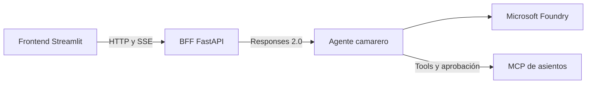

# Restaurante multiagente

Este repositorio contiene el diseño y el plan de implementación de una demo
para explicar, de forma sencilla, cómo funciona una arquitectura multiagente.

La demo utiliza la experiencia de un restaurante: un camarero coordina la
atención al cliente, un chef valida los pedidos y varios agentes especialistas
colaboran para consultar la carta, comprobar existencias, preparar la comida y
gestionar la cuenta.

El objetivo es mostrar conceptos como:

- colaboración y delegación entre agentes;
- memoria y recuperación de contexto;
- uso de herramientas y datos verificables;
- confirmaciones humanas antes de acciones importantes;
- comunicación con sistemas externos;
- observabilidad del flujo completo.

## Documentación

- [Especificación funcional](SPECS.md)
- [Plan de implementación](PLAN_IMPLEMENTACION.md)
- [Progreso de implementación](PROGRESO.md)
- [Convenciones de estructura y nombres](CONVENCIONES.md)
- [Contratos públicos de fase 3A](packages/contracts/README.md)

El proyecto está planteado como una demo incremental con Python, Microsoft Agent
Framework, Microsoft Foundry, FastAPI y Streamlit.

## Desarrollo

El camarero y su memoria local automática viven en
[`agents/restaurant`](agents/restaurant). Para preparar el entorno y ejecutar
sus pruebas:

```bash
./scripts/setup.sh
./scripts/test.sh
```

La fase 3A añade contratos tipados, fixtures y pruebas compartidas en
[`packages/contracts`](packages/contracts). El mismo comando valida el camarero,
los contratos y su compatibilidad.

La vista de cliente en Streamlit ([`apps/frontend`](apps/frontend)) funciona
con un camarero simulado: `./scripts/setup-frontend.sh` y después
`./scripts/run-frontend.sh` (puerto 8501); sus pruebas, con
`./scripts/test-frontend.sh`.

El BFF ([`apps/bff`](apps/bff)) conecta esa vista con el agente independiente
por Responses 2.0. El agente usa el modelo de Microsoft Foundry y escucha en
el puerto 8088; el BFF escucha en el 8000. Usa `./scripts/setup-bff.sh`,
`./scripts/test-bff.sh` y `./scripts/run-bff.sh`. La vista lo usa con
`FRONTEND_BFF_CLIENT=http FRONTEND_BFF_URL=http://127.0.0.1:8000
./scripts/run-frontend.sh`. Configuración y permisos en
[su README](apps/bff/README.md).

Las mesas y la barra (fase 4) salen del MCP de asientos
([`services/mcp`](services/mcp)): `./scripts/run-mcp.sh` (puerto 8080;
`--reset` vacía la sala) y el agente con
`SEATING_MCP_URL=http://127.0.0.1:8080/mcp`. El camarero es el único cliente
del MCP: el BFF no lo usa. `./scripts/test-e2e-seating.sh` prueba el
recorrido de asientos sin Foundry.



Para crear una configuración local reutilizable:

```bash
./scripts/init-local-env.sh
source ./.local/restaurant.env.sh
./scripts/run-local.sh
```

La memoria se lee y guarda automáticamente para la identidad autenticada
resuelta por el servidor, incluida la identidad falsa de desarrollo. Los
invitados no tienen perfil duradero. Los recuerdos conservan procedencia y
límites, son no vinculantes y las restricciones se reconfirman en cada visita.
No sustituyen un pedido confirmado ni su historial.

Si ya tienes un `.env` local, elimina `DEV_FAKE_MEMORY_CONSENT` y regenera el
entorno con `./scripts/init-local-env.sh --force`. Vuelve a cargar el fichero
generado; la antigua variable exportada ya no se utiliza y puede retirarse con
`unset DEV_FAKE_MEMORY_CONSENT`.

Para listar o borrar memorias locales de una identidad:

```bash
./scripts/manage-memory.sh --actor-id Majo list
./scripts/manage-memory.sh --actor-id Majo delete <memory-id>
./scripts/manage-memory.sh --actor-id Majo clear --yes
```

El borrado total (también `/memory clear` en la CLI) olvida los recuerdos
existentes; no desactiva el guardado automático de interacciones futuras.

Consulta el README del agente para ejecutar la CLI, el servidor local o el smoke
test opt-in contra Foundry.

## Despliegue en Azure Container Apps

El script [`scripts/deploy-container-apps.sh`](scripts/deploy-container-apps.sh)
crea o actualiza, dentro de un grupo de recursos que ya existe, una identidad
administrada, un entorno de Container Apps y las cuatro aplicaciones. Solo el
frontend tiene entrada externa; BFF, agente y MCP usan entrada interna y se
descubren mediante sus FQDN del mismo entorno. El grupo de recursos y el
proyecto de Foundry son prerrequisitos: el script no los crea, y tampoco
modifica el grupo.

Por ahora BFF y MCP guardan sus bases SQLite en el almacenamiento efímero de su
propio contenedor (`/data`), sin volúmenes ni cuentas de almacenamiento. Cada
aplicación queda fijada a una réplica, y las visitas, la memoria y las mesas se
pierden cada vez que una réplica se reinicia o se despliega una revisión nueva.
La persistencia duradera en Cosmos DB llega en la fase 9.

Requisitos: Bash, Python 3, Azure CLI con la extensión `containerapp`, una sesión
iniciada con `az login`, permisos para crear recursos y asignaciones RBAC, el
grupo de recursos ya creado (por ejemplo con `az group create`) y el proyecto de
Foundry con su modelo desplegado. Copia el ejemplo versionado y completa todos
sus marcadores:

```bash
cp scripts/container-apps.env.example scripts/container-apps.env
${EDITOR:-vi} scripts/container-apps.env
./scripts/deploy-container-apps.sh scripts/container-apps.env
```

El fichero usa sintaxis simple `NOMBRE=valor`; el script lo analiza sin
ejecutarlo como Bash. No necesita secretos ni credenciales de registro: recibe
cuatro referencias públicas completas de GHCR y las despliega directamente. Usa preferentemente digest
`sha256` o etiquetas de commit SHA, nunca `latest`. La identidad solo se asigna
al agente y recibe `Azure AI User` sobre el proyecto Foundry indicado.
Conviene mantener `scripts/container-apps.env` fuera del control de versiones.

El despliegue es idempotente y no construye ni publica imágenes, pero no realiza
una previsualización: revisa el fichero de entorno antes de ejecutarlo. Para
validar solo la sintaxis sin crear recursos:

```bash
bash -n scripts/deploy-container-apps.sh
```
