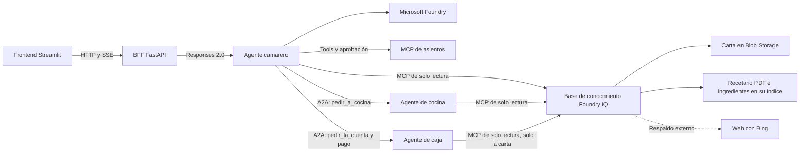

# Restaurante multiagente

Este repositorio contiene el diseño y el plan de implementación de una demo
para explicar, de forma sencilla, cómo funciona una arquitectura multiagente.

La demo utiliza la experiencia de un restaurante: un camarero coordina la
atención al cliente, un chef valida los pedidos y varios agentes especialistas
colaboran para consultar la carta, comprobar existencias, preparar la comida y
gestionar la cuenta.

El objetivo es mostrar conceptos como:

- colaboración y delegación entre agentes;
- memoria y recuperación de contexto;
- uso de herramientas y datos verificables;
- confirmaciones humanas antes de acciones importantes;
- comunicación con sistemas externos;
- observabilidad del flujo completo.

## Documentación

- [Especificación funcional](SPECS.md)
- [Plan de implementación](PLAN_IMPLEMENTACION.md)
- [Progreso de implementación](PROGRESO.md)
- [Convenciones de estructura y nombres](CONVENCIONES.md)
- [Contratos públicos de fase 3A](packages/contracts/README.md)
- [Conocimiento del restaurante: carta, recetario e ingredientes](data/knowledge/README.md)

El proyecto está planteado como una demo incremental con Python, Microsoft Agent
Framework, Microsoft Foundry, FastAPI y Streamlit.

## Desarrollo

El camarero y su memoria local automática viven en
[`agents/restaurant`](agents/restaurant). Para preparar el entorno y ejecutar
sus pruebas:

```bash
./scripts/setup.sh
./scripts/test.sh
```

La fase 3A añade contratos tipados, fixtures y pruebas compartidas en
[`packages/contracts`](packages/contracts). El mismo comando valida el camarero,
los contratos y su compatibilidad, y la coherencia de la carta, el recetario y
los ingredientes.

La vista de cliente en Streamlit ([`apps/frontend`](apps/frontend)) funciona
con un camarero simulado: `./scripts/setup-frontend.sh` y después
`./scripts/run-frontend.sh` (puerto 8501); sus pruebas, con
`./scripts/test-frontend.sh`.

El BFF ([`apps/bff`](apps/bff)) conecta esa vista con el agente independiente
por Responses 2.0. El agente usa el modelo de Microsoft Foundry y escucha en
el puerto 8088; el BFF escucha en el 8000. Usa `./scripts/setup-bff.sh`,
`./scripts/test-bff.sh` y `./scripts/run-bff.sh`. La vista lo usa con
`FRONTEND_BFF_CLIENT=http FRONTEND_BFF_URL=http://127.0.0.1:8000
./scripts/run-frontend.sh`. Configuración y permisos en
[su README](apps/bff/README.md).

Las mesas y la barra (fase 4) salen del MCP de asientos
([`services/mcp`](services/mcp)): `./scripts/run-mcp.sh` (puerto 8080;
`--reset` vacía la sala) y el agente con
`SEATING_MCP_URL=http://127.0.0.1:8080/mcp`. El camarero es el único cliente
del MCP: el BFF no lo usa. `./scripts/test-e2e-seating.sh` prueba el
recorrido de asientos sin Foundry.

La carta, el recetario y los ingredientes (fase 5) salen de la
[base de conocimiento de Foundry IQ](#base-de-conocimiento-foundry-iq): el
camarero la consulta por su endpoint MCP si recibe `AZURE_SEARCH_ENDPOINT` y
`KNOWLEDGE_BASE_NAME`; sin ellas funciona como antes y dice que no puede
consultar la carta.

Son seis contenedores: frontend, BFF, camarero, cocina, caja y MCP de
asientos.



Para crear una configuración local reutilizable:

```bash
./scripts/init-local-env.sh
source ./.local/restaurant.env.sh
./scripts/run-local.sh
```

La memoria se lee y guarda automáticamente para la identidad autenticada
resuelta por el servidor, incluida la identidad falsa de desarrollo. Los
invitados no tienen perfil duradero. Los recuerdos conservan procedencia y
límites, son no vinculantes y las restricciones se reconfirman en cada visita.
No sustituyen un pedido confirmado ni su historial.

Si ya tienes un `.env` local, elimina `DEV_FAKE_MEMORY_CONSENT` y regenera el
entorno con `./scripts/init-local-env.sh --force`. Vuelve a cargar el fichero
generado; la antigua variable exportada ya no se utiliza y puede retirarse con
`unset DEV_FAKE_MEMORY_CONSENT`.

Para listar o borrar memorias locales de una identidad:

```bash
./scripts/manage-memory.sh --actor-id Majo list
./scripts/manage-memory.sh --actor-id Majo delete <memory-id>
./scripts/manage-memory.sh --actor-id Majo clear --yes
```

El borrado total (también `/memory clear` en la CLI) olvida los recuerdos
existentes; no desactiva el guardado automático de interacciones futuras.

Consulta el README del agente para ejecutar la CLI, el servidor local o el smoke
test opt-in contra Foundry.

## Base de conocimiento (Foundry IQ)

La carta, el recetario y los ingredientes del restaurante forman una única base
de conocimiento de Foundry IQ (recuperación agéntica de Azure AI Search) con
exactamente tres fuentes:

| Fuente | Tipo | Contenido |
|---|---|---|
| `carta-de-la-casa` | Blob de Azure Storage (contenedor `carta`) | [La carta](data/knowledge/menu/carta.md), por partidas, con precios, alérgenos y advertencias |
| `recetario-de-la-casa` | Índice propio (`recetario-index`) | [El recetario en PDF](data/knowledge/recipes/recetario.pdf) y [la ficha de ingredientes](data/knowledge/ingredients/ingredientes.md), indexados desde el contenedor `recetario` |
| `web-bing` | Web (Grounding with Bing) | Solo respaldo externo para información pública general |

La base `conocimiento-restaurante` planifica cada consulta con un modelo del
proyecto Foundry (`gpt-4.1-mini`), con esfuerzo `low` y salida extractiva, y
tiene sus instrucciones de recuperación en español: la carta y el recetario
primero, la web nunca para precios, existencias ni lo que ofrece el
restaurante. El camarero la consulta por el **endpoint MCP propio de la base**
(versión `2026-08-01-preview`), sin servidores intermedios; el
[chef](#cocina-chef-v1) usa la misma base y la despensa seguirá siendo un MCP
operacional aparte. Detalles del camarero en
[su README](agents/restaurant/README.md#carta-y-base-de-conocimiento-foundry-iq).

Como Foundry y el grupo de recursos, la base de conocimiento es un
prerrequisito del despliegue. Requisitos: Bash, Python 3, curl, Azure CLI con
sesión iniciada, permisos para crear recursos y asignaciones RBAC, el grupo de
recursos ya creado y el proyecto Foundry con un deployment de chat compatible
(por ejemplo, `gpt-4.1-mini`). No hace falta ningún modelo de embeddings.

```bash
cp scripts/knowledge.env.example scripts/knowledge.env
${EDITOR:-vi} scripts/knowledge.env
./scripts/provision-knowledge.sh scripts/knowledge.env
```

El script es idempotente y crea o actualiza, en una región con recuperación
agéntica (por ejemplo, `swedencentral`):

- una cuenta de almacenamiento sin acceso por clave compartida, con los
  contenedores `carta` y `recetario`, donde sube los documentos de
  [`data/knowledge`](data/knowledge);
- un servicio de Azure AI Search (Basic) con identidad administrada y solo
  autenticación Entra ID;
- el índice `recetario-index` y su indexador, que trocea el PDF y la ficha de
  ingredientes; las definiciones están en [`infra/knowledge`](infra/knowledge);
- las tres fuentes y la base de conocimiento;
- los roles: la identidad del buscador lee el almacenamiento (Storage Blob Data
  Reader) y usa el modelo (Cognitive Services User sobre el recurso Foundry);
  quien ejecuta el script puede subir documentos, administrar y consultar la
  base; opcionalmente, la identidad del camarero recibe Search Index Data
  Reader.

Al terminar, consulta la base por REST y por MCP e imprime los valores para
`scripts/container-apps.env` y para un camarero local. Para repetir las
consultas:

```bash
export AZURE_SEARCH_ENDPOINT="https://<servicio>.search.windows.net"
export KNOWLEDGE_BASE_NAME="conocimiento-restaurante"
./scripts/query-knowledge.sh "¿Qué tenéis típico de Burgos?"
./scripts/query-knowledge.sh --mcp "¿Qué lleva la morcilla?"
```

Si cambias la carta, el recetario o los ingredientes, vuelve a ejecutar el
script: sube los documentos de nuevo y reindexa. Para regenerar el PDF desde
su HTML, `./scripts/build-recetario-pdf.sh`.

Coste mensual estimado:

| Concepto | Estimación |
|---|---|
| Azure AI Search Basic (swedencentral) | unos 74 US$ (0,101 US$/hora; se factura aunque no se use) |
| Almacenamiento Blob (menos de 1 MB) | menos de 0,01 US$ |
| Recuperación agéntica | 0 US$ con el plan gratuito del servicio hasta su cupo mensual; al agotarlo, la base responde con error y el camarero lo dice |
| Web (Grounding with Bing) | 14 US$ por 1.000 transacciones; una pregunta web típica hace 3 búsquedas (unos 0,04 US$) |
| `gpt-4.1-mini` (planificación y resúmenes web) | menos de 0,002 US$ por consulta |
| `gpt-5.6-luna` (camarero) | unos miles de tokens más por pregunta sobre la carta |

> [!IMPORTANT]
> La fuente web usa Grounding with Bing: las consultas que la base envía a la
> web salen del límite de cumplimiento y geográfico de Azure, no les aplica el
> Data Protection Addendum de Microsoft y se rigen por los términos de uso de
> Grounding with Bing, que exigen mostrar las citas al usuario. Tiene coste por
> uso. Un administrador puede desactivarla en la suscripción con
> `az feature register --name WebKnowledgeSourceDisabled --namespace Microsoft.Search`.

Para dejar de pagar, borra el servicio de búsqueda y la cuenta de
almacenamiento (`az search service delete` y `az storage account delete`); el
servicio Basic no se puede pausar.

## Cocina: chef v1

Cuando el pedido está claro, el camarero se lo pasa al chef con la tool
`pedir_a_cocina`: platos, cantidades, modificaciones («sin cebolla») y las
alergias o intolerancias declaradas, nada más. El chef es un agente de Agent
Framework sin sesión ni memoria que vive en su propio contenedor. El camarero
lo invoca mediante A2A y el chef consulta la misma base de conocimiento:

- comprueba cada plato en la carta y rechaza, con su motivo, lo que no está;
- consulta el recetario: partida, ingredientes y alérgenos;
- aplica las modificaciones solo si la receta lo permite;
- aplica las alergias e intolerancias con los alérgenos declarados, sin
  deducirlos, y avisa de la información pendiente de verificar;
- coordina un group chat con los especialistas de parrilla, fritos y general;
  por ahora los tres aceptan siempre las tareas que reciben;
- reparte el trabajo por partidas (brasa, fritos, pinchos fríos y barra) y cita
  sus fuentes.

Nuestro código valida su respuesta antes de que llegue al camarero: cada línea
se acepta o se rechaza una sola vez y con la cantidad pedida, un plato aceptado
tiene que aparecer en la carta que devolvió la base, y su partida y sus
alérgenos son los de esa carta. Si la base no está configurada o no responde,
si el chef falla o si se pasa de tiempo, el resultado es un fallo explícito de
cocina, nunca un plan inventado.

En la vista, el plan del chef aparece en la misma conversación como una burbuja
propia, azul con texto blanco y un gorro de cocinero, entre el mensaje del
cliente y la respuesta del camarero, que resume el veredicto sin cambiarlo.
Todavía no hay tiempos, despensa ni confirmación del pedido. Detalles en el
[README de cocina](agents/kitchen/README.md) y el
[README del camarero](agents/restaurant/README.md#cocina).

## Barra: bebidas v1

Las bebidas no pasan por cocina: las sirve el propio camarero desde la barra,
sin otro agente ni otro contenedor. Desde Barra v1 (08/10) servir es una
operación tipada y determinista: tras la confirmación del cliente, el camarero
llama a `servir_bebidas` con las bebidas y las alergias declaradas, y en un
pedido mixto envía la comida a `pedir_a_cocina` en el mismo turno.

- La barra es código, no un modelo. Consulta la base de conocimiento con la
  misma conexión MCP del camarero, lee solo las entradas de la carta de la casa
  con `Partida: barra` y resuelve cada nombre, sin acentos ni plurales, a una
  sola bebida: «agua» es ambigua (con gas o sin gas) y se rechaza con las
  opciones, y lo que no está en la carta se rechaza con su motivo.
- Aplica la misma regla de alérgenos que cocina: a quien declara celiaquía no
  se le sirve una caña, que contiene cereales con gluten (cebada).
- Sin base de conocimiento, si no responde o si no devuelve bebidas, no sirve
  nada y lo dice.
- La ronda aparece en la conversación como una burbuja propia, ámbar tostado
  con texto blanco y una caña, después de la del chef y antes de la respuesta
  del camarero. No hay pase: el BFF la anota como servida al momento y sus
  bebidas se cobran con los platos servidos.

Detalles en el
[README del camarero](agents/restaurant/README.md#barra-bebidas-servidas-por-el-camarero).

## Caja: cobro v1

Acuerdo del 06/10: la caja es un agente A2A en su propio contenedor,
[`agents/cashier`](agents/cashier). Cuando el cliente pide la cuenta, el
camarero llama a `pedir_la_cuenta`, una tool sin argumentos: el modelo no
elige qué se cobra. El BFF le pasa en cada turno los platos de cocina y las
bebidas de la barra ya servidos; lo rechazado y lo que sigue en el pase nunca
se cobra.

- La caja busca esos platos en la carta con la misma base de conocimiento y es
  el código, no el modelo, quien cobra: lee cada precio de la carta («Precio:
  8,50 € la ración»), nunca de la web ni del recetario, y suma con `Decimal` en
  euros. Un precio ausente o incoherente es un fallo explícito, nunca un
  importe inventado.
- La tarea A2A queda en `input-required` con la cuenta. En la vista aparece una
  burbuja verde de caja, con su caja registradora, entre la petición y la
  respuesta del camarero, y debajo dos botones, «Tarjeta» y «Efectivo». Una
  frase nunca paga.
- El botón llega al camarero como `pay_bill`, sin modelo, que reanuda la misma
  tarea A2A. El pago es simulado y siempre se aprueba; repetirlo devuelve el
  mismo recibo y nunca cobra dos veces.
- Con el recibo, el camarero se despide con un texto fijo y el BFF cierra la
  visita por el mismo camino que «Salir», así que el sitio queda libre. La vista
  enseña el recibo y la despedida unos segundos y vuelve a la puerta.
- Si el cliente pide más platos con la cuenta pendiente, esa cuenta se anula y
  hay que volver a pedirla.
- La revisión del ticket por una persona en caja (SPECS) queda preparada como
  etapa opcional, `CASHIER_REQUIRE_REVIEW`, desactivada y sin interfaz.

Para probarla en local, arranca la caja y pásale su URL al camarero:

```bash
cd agents/cashier/src/cashier_agent
cp .env.example .env   # proyecto de Foundry y base de conocimiento
uv sync --all-groups
.venv/bin/python main.py   # puerto 8090
# en el entorno del camarero:
CASHIER_A2A_URL=http://127.0.0.1:8090
```

En el plano, el cajero espera junto a la puerta de salida y se ilumina mientras
hay una cuenta pendiente. Detalles en el [README de caja](agents/cashier/README.md)
y el [README del camarero](agents/restaurant/README.md#caja-externa-mediante-a2a).

## Despliegue en Azure Container Apps

El script [`scripts/deploy-container-apps.sh`](scripts/deploy-container-apps.sh)
crea o actualiza, dentro de un grupo de recursos que ya existe, una identidad
administrada, un entorno de Container Apps y las seis aplicaciones. Solo el
frontend tiene entrada externa; BFF, camarero, cocina, caja y MCP usan entrada
interna y se descubren mediante sus FQDN del mismo entorno. El grupo de
recursos y el
proyecto de Foundry son prerrequisitos: el script no los crea, y tampoco
modifica el grupo. La [base de conocimiento](#base-de-conocimiento-foundry-iq)
es un prerrequisito opcional con su propio script.

Por ahora BFF y MCP guardan sus bases SQLite en el almacenamiento efímero de su
propio contenedor (`/data`), sin volúmenes ni cuentas de almacenamiento. Cada
aplicación queda fijada a una réplica, y las visitas, la memoria y las mesas se
pierden cada vez que una réplica se reinicia o se despliega una revisión nueva.
La persistencia duradera en Cosmos DB llega en la fase 9.

Requisitos: Bash, Python 3, Azure CLI con la extensión `containerapp`, una sesión
iniciada con `az login`, permisos para crear recursos y asignaciones RBAC, el
grupo de recursos ya creado (por ejemplo con `az group create`) y el proyecto de
Foundry con su modelo desplegado. La base de conocimiento es opcional. Copia el
ejemplo versionado y completa todos sus marcadores:

```bash
cp scripts/container-apps.env.example scripts/container-apps.env
${EDITOR:-vi} scripts/container-apps.env
./scripts/deploy-container-apps.sh scripts/container-apps.env
```

El fichero usa sintaxis simple `NOMBRE=valor`; el script lo analiza sin
ejecutarlo como Bash. No necesita secretos ni credenciales de registro: recibe
seis referencias públicas completas de GHCR y las despliega directamente. Usa preferentemente digest
`sha256` o etiquetas de commit SHA, nunca `latest`. La identidad solo se asigna
a los agentes (camarero, cocina y caja) y recibe `Foundry User` sobre el
proyecto Foundry indicado.
Conviene mantener `scripts/container-apps.env` fuera del control de versiones.

Para que el camarero desplegado consulte la carta, añade al fichero los tres
valores que imprime `provision-knowledge.sh`: `AZURE_SEARCH_RESOURCE_ID`,
`AZURE_SEARCH_ENDPOINT` y `KNOWLEDGE_BASE_NAME` (y, si quieres,
`KNOWLEDGE_BASE_TIMEOUT_SECONDS`, 20 por defecto). Van juntos: con ellos, la
identidad del agente recibe además `Search Index Data Reader` sobre el servicio
de búsqueda y el agente recibe la configuración de la base. Sin ellos, el
despliegue no cambia y los ficheros de entorno existentes siguen sirviendo.

El chef vive en una Container App independiente y publica A2A. Usa el mismo
proyecto, modelo y base de conocimiento; sin esta última, cocina responde que
no puede consultar la carta. El script crea la aplicación, configura su Agent
Card con la URL interna e inyecta `KITCHEN_A2A_URL` en el camarero.
`KITCHEN_TIMEOUT_SECONDS` limita la llamada A2A y toda la orquestación de cocina
(30 s por defecto) y debe dejar margen dentro de
`WAITER_AGENT_TIMEOUT_SECONDS`; el script avisa si queda menos de 20 s.

La caja es la sexta aplicación y se despliega igual que la cocina, en el puerto
8090: necesita `CASHIER_AGENT_IMAGE`; `CASHIER_AGENT_APP_NAME` vale
`morcilla-cashier` por defecto. Usa el mismo proyecto, modelo, identidad y base
de conocimiento, y el script inyecta `CASHIER_A2A_URL` en el camarero.
`CASHIER_TIMEOUT_SECONDS` (30 s por defecto) limita la consulta de precios y
cada llamada A2A, con el mismo aviso de margen. La revisión humana en caja se
despliega desactivada. Como las tareas y los pagos de caja viven en memoria,
la aplicación se queda en una réplica, como las demás.

### Trazas distribuidas en Application Insights

La observabilidad usa los spans nativos de Agent Framework y OpenTelemetry,
siguiendo la
[documentación oficial](https://learn.microsoft.com/agent-framework/agents/observability?pivots=programming-language-python).
El BFF, el camarero, cocina y caja exportan únicamente trazas a un Application
Insights basado en Log Analytics. La instrumentación ASGI extrae el contexto
entrante y la de `httpx` inyecta `traceparent` y `tracestate`, por lo que una
petición conserva el mismo trace ID a través de BFF, camarero y llamadas A2A.
Los agentes auxiliares que viven en el proceso del camarero o de cocina quedan
como spans hijos mediante la instrumentación de Agent Framework.

La captura de prompts, respuestas, argumentos y resultados está desactivada.
Tampoco se exportan logs ni métricas en esta fase. Sin
`APPLICATIONINSIGHTS_CONNECTION_STRING`, la instrumentación permanece
deshabilitada y el comportamiento local no cambia.

Provisiona los recursos workspace-based:

```bash
cp scripts/observability.env.example scripts/observability.env
${EDITOR:-vi} scripts/observability.env
./scripts/provision-observability.sh scripts/observability.env
```

El script imprime `APPLICATIONINSIGHTS_RESOURCE_ID` y
`APPLICATIONINSIGHTS_CONNECTION_STRING`. Copia ambos valores en
`scripts/container-apps.env` y vuelve a ejecutar `deploy-container-apps.sh`.
La cadena identifica el destino de ingestión pero no concede acceso de lectura
a la telemetría.

El despliegue es idempotente y no construye ni publica imágenes, pero no realiza
una previsualización: revisa el fichero de entorno antes de ejecutarlo. Para
validar solo la sintaxis sin crear recursos:

```bash
bash -n scripts/deploy-container-apps.sh
```
