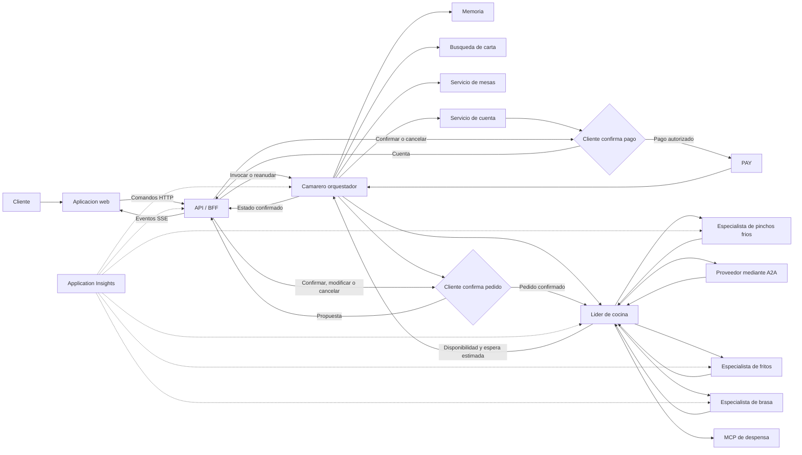

# Escenario reevaluado: restaurante multiagente

## 1. Objetivo de la demo

La demo debe explicar una arquitectura multiagente mediante una experiencia de
restaurante fácil de entender. El objetivo no es mostrar el mayor número posible
de agentes, sino enseñar cómo varios componentes colaboran con responsabilidades
claras, contexto compartido y datos verificables.

La primera demostración debe durar entre **3 y 5 minutos** y completar un
recorrido reconocible:

1. Un cliente entra en el restaurante.
2. El camarero obtiene su identidad y el número de comensales.
3. El sistema busca y asigna una mesa.
4. El cliente consulta la carta y propone un pedido.
5. La sesión se cierra y se abre de nuevo.
6. El camarero recupera el contexto y permite repetir o continuar el pedido.
7. El chef líder valida la disponibilidad, consulta a los especialistas y
   confirma al camarero el pedido viable con su tiempo de espera estimado.
8. El camarero presenta esa confirmación al cliente y solicita su aprobación.
9. Tras la confirmación humana, cocina prepara y entrega el plato.
10. El cliente solicita la cuenta y el camarero la genera.
11. El cliente confirma el pago y el camarero coordina su procesamiento.
12. Después de un pago correcto, el cliente solicita liberar la mesa.

Después de este recorrido guiado, la aplicación puede quedar disponible para que
los asistentes la prueben mientras se explican la arquitectura, las llamadas
entre agentes, las herramientas y la observabilidad.

## 2. Principios de diseño

### Experiencia antes que complejidad

La historia principal debe funcionar de extremo a extremo antes de incorporar
variantes avanzadas. Cada capacidad técnica debe corresponder a algo visible en
la demo:

- Memoria: recordar preferencias y restricciones consentidas como contexto no
  vinculante entre visitas.
- RAG o búsqueda: responder preguntas sobre la carta.
- MCP: consultar datos operativos como mesas o existencias.
- Multiagente: delegar la preparación del pedido en especialistas.
- A2A: solicitar productos a un proveedor externo.
- Human in the loop: confirmar el pedido después de hablar con cocina.
- Human in the loop: autorizar el pago después de recibir la cuenta.
- Application Insights: explicar qué ocurrió y cuánto tardó cada paso.

### Eventos iniciados desde el frontal

Todas las acciones del recorrido se inician mediante eventos o invocaciones del
frontal. Esto incluye la llegada del cliente, los mensajes, la confirmación del
pedido, la solicitud de cuenta, la autorización del pago y la solicitud de
liberación de la mesa.

El frontal inicia la acción, pero no modifica directamente el estado de negocio.
El camarero recibe el evento, valida que la transición sea posible y coordina la
herramienta o servicio correspondiente. Cada invocación debe incluir un
identificador idempotente para que un reintento no genere dos cuentas, dos cobros
o dos liberaciones de la misma mesa. Toda la experiencia ocurre en una única
vista y bajo la identidad del cliente.

### Preguntar solo lo necesario

El camarero utiliza directamente los datos presentes en el mensaje o ya
disponibles en el contexto. Solo pregunta por los campos imprescindibles que
falten.

Ejemplos:

- «Hola, soy Majo y venimos dos» permite buscar mesa sin preguntas previas.
- Si no se indica el tamaño del grupo, se asume una persona.
- Solo una petición explícita de mesa sin tamaño de grupo requiere preguntar el
  número de comensales.
- Un recuerdo puede sugerirse o solicitarse para reconfirmación, pero nunca debe
  reemplazar una indicación actual.

### Autoridad limitada

Cada agente o herramienta responde únicamente sobre su dominio:

- El camarero conversa, recopila datos y coordina.
- El servicio de mesas determina la disponibilidad real.
- La búsqueda documental responde sobre carta, ingredientes y alérgenos.
- La despensa informa de existencias.
- Cocina decide si puede preparar la comanda.
- El proveedor confirma si puede suministrar un producto.
- El servicio de cuenta calcula importes exactos.
- El proveedor de pago confirma el resultado del cobro.
- El servicio de mesas cambia la ocupación cuando el camarero procesa una
  solicitud válida de liberación del cliente.

Ningún agente debe inventar datos que pertenecen a otro sistema.

### Arquitectura explicable

El contexto debe pasar por pasos explícitos y observables. La audiencia debe
poder distinguir entre:

- conversación;
- estado de la sesión;
- memoria persistente;
- conocimiento documental;
- estado operacional;
- delegación entre agentes;
- efectos reales, como reservar una mesa o crear una cuenta.

## 3. Experiencia principal

La interfaz se centra en una **caja de texto**. Debajo se muestran las mesas
virtuales y su estado, de forma que la ocupación del restaurante cambie a medida
que entran clientes.

Estados mínimos de una mesa:

- libre;
- reservada temporalmente;
- ocupada;
- pendiente de confirmación del pedido;
- pendiente de cuenta;
- cuenta pendiente de confirmación;
- pago en curso;
- pagada;
- libre.

La interfaz puede incorporar información secundaria, pero no debe competir con
la conversación. Para el primer incremento basta con:

- historial de mensajes;
- caja de texto;
- identificación visible del cliente;
- mesas virtuales;
- pedido actual;
- estado breve del proceso.

El frontal también ofrece acciones contextuales que generan eventos:

- confirmar, modificar o cancelar el pedido;
- solicitar cuenta;
- confirmar o cancelar el pago;
- liberar mesa.

Las acciones solo se habilitan cuando corresponden al estado actual. La
confirmación visual se muestra después de que el camarero haya procesado la
invocación, no de forma optimista antes de conocer el resultado.

La vista técnica puede mostrarse durante la explicación posterior y presentar:

- agente activo;
- paso actual;
- llamadas a herramientas;
- transferencia de contexto;
- `conversation_id`, `order_id` y `trace_id`;
- latencia y errores;
- eventos enviados a Application Insights.

### Integración técnica del frontal

El navegador no invoca directamente Microsoft Foundry, los agentes, MCP ni el
proveedor de pago. Se conecta a una API/BFF que actúa como frontera de seguridad
y adaptación entre la experiencia web y el workflow.

Para la demo se recomienda un modelo sencillo:

- **HTTP para comandos:** el frontal envía mensajes y acciones explícitas.
- **SSE para actualizaciones:** el BFF transmite cambios de estado, respuestas
  parciales y solicitudes de aprobación. SSE es suficiente porque las acciones
  del usuario ya viajan por HTTP y simplifica la reconexión respecto a un
  WebSocket bidireccional.
- **Consulta de snapshot:** al abrir o recargar la página, el frontal recupera el
  estado confirmado de la conversación, mesa, pedido, cuenta y workflow.

El frontal inicia comandos de negocio, pero no cada invocación interna. Por
ejemplo, `order.submitted` inicia la atención del pedido; a partir de ahí el
camarero y el líder de cocina coordinan memoria, RAG, MCP, especialistas y A2A
sin que la interfaz conozca esos detalles.

Comandos mínimos del frontal:

| Comando | Vista que lo emite | Resultado esperado |
|---|---|---|
| `customer.arrived` | Cliente | Sesión creada y búsqueda de mesa |
| `conversation.message_sent` | Cliente | Respuesta del camarero y estado actualizado |
| `order.submitted` | Cliente | Propuesta enviada a cocina para validación |
| `order.confirmation_decided` | Cliente | Pedido confirmado, modificado o cancelado |
| `bill.requested` | Cliente | Cuenta generada y pago pendiente de confirmación |
| `payment.confirmation_decided` | Cliente | Pago autorizado o cancelado |
| `table.release_requested` | Cliente | Mesa liberada si el pago está confirmado |

Cada comando utiliza un sobre común:

```json
{
  "event_id": "evt_...",
  "event_type": "bill.requested",
  "occurred_at": "2026-09-24T11:28:00Z",
  "actor": {
    "actor_id": "customer_..."
  },
  "conversation_id": "conv_...",
  "table_id": "table_07",
  "payload": {}
}
```

El BFF debe:

- autenticar al cliente y comprobar que la sesión, mesa, pedido y cuenta le
  pertenecen;
- generar o validar `event_id`, correlación e idempotencia;
- rechazar transiciones incompatibles con el estado actual;
- invocar o reanudar el workflow correspondiente;
- persistir el resultado antes de confirmarlo al navegador;
- publicar por SSE solo estados confirmados;
- permitir reconexión mediante el último identificador de evento.

El frontal no envía ni almacena datos de tarjeta. La integración de pago utiliza
el formulario o componente seguro del proveedor y entrega al BFF únicamente un
token o referencia de pago.

La interfaz mantiene una proyección visual del estado, no la fuente de verdad.
Después de una recarga debe reconstruirse desde el snapshot del backend. Si un
comando queda pendiente, el frontal muestra ese estado y evita enviarlo de nuevo
sin conservar la misma clave de idempotencia.

La aplicación ofrece una única vista de cliente. Tras identificarse, el usuario
entra en el restaurante y completa desde esa misma pantalla todo el recorrido:
mesa, conversación, pedido, confirmaciones, cuenta, pago y liberación.

El modo para asistentes debe utilizar sesiones aisladas y pagos simulados. Cada
cliente solo puede consultar o modificar su propia sesión, pedido, cuenta y mesa.

## 4. Guion de la demostración

### Escena 1: entrada y asignación de mesa

Mensaje de ejemplo:

> Hola, soy Majo y venimos dos.

El camarero detecta que ya dispone de identidad y número de comensales. Consulta
la disponibilidad y asigna una mesa con capacidad suficiente. La mesa cambia de
libre a ocupada en la interfaz.

Variante para demostrar recopilación selectiva:

> Hola, queremos comer.

En este caso, el camarero pregunta únicamente por los datos que faltan antes de
consultar mesas.

### Escena 2: consulta y pedido

El cliente pregunta por la carta o por un plato. La información descriptiva
procede de la búsqueda documental. Antes de aceptar el pedido, la disponibilidad
real de ingredientes procede de la despensa.

Ejemplo:

> ¿Qué tenéis típico de Burgos? Quiero una morcilla y agua con gas.

El camarero construye un borrador estructurado del pedido y muestra un resumen
comprensible para el cliente. La comanda definitiva todavía no se crea.

### Escena 3: cierre y recuperación

Se cierra la conversación y se abre una sesión nueva con la misma identidad. El
camarero recupera las preferencias y restricciones autorizadas, diferenciadas
por categoría y siempre como contexto no vinculante.

Ejemplo:

> ¿Puedo repetir lo de antes?

El sistema recuerda la preferencia por agua con gas, una posible restricción o
pedidos anteriores, pero vuelve a comprobar carta y existencias. Una restricción
recordada se reconfirma en la visita actual. La memoria nunca se utiliza como
prueba de disponibilidad ni como confirmación del pedido.

### Escena 4: preparación y entrega

El camarero transfiere el borrador al líder de cocina. El líder valida la
disponibilidad en la despensa y distribuye las elaboraciones entre los
especialistas. Cada especialista responde si acepta su parte y cuánto tardará.

Con esas respuestas, el chef líder consolida los productos disponibles, los
rechazos, las sustituciones y el tiempo de espera estimado del pedido completo.
El chef líder confirma ese resultado al camarero. Solo entonces el camarero
presenta al cliente el pedido definitivo y el tiempo estimado.

El workflow se pausa hasta que el cliente decide desde la misma vista:

- **Confirmar:** se crea la comanda definitiva y comienza la preparación.
- **Modificar:** el cambio vuelve a cocina y se genera una nueva propuesta que
  requiere otra confirmación.
- **Cancelar:** no se crea la comanda y el cliente puede empezar otro pedido.

Este es el primer human in the loop. Ningún plato comienza a prepararse sin una
confirmación explícita del cliente.

Tras la aprobación, la interfaz muestra una progresión sencilla:

`pedido confirmado -> en cocina -> preparado -> entregado`

### Escena 5: cuenta, pago y liberación de mesa

El frontal emite una solicitud de cuenta. El camarero valida que el pedido esté
entregado, invoca el servicio de cuenta, presenta el desglose de los elementos
confirmados y pausa el workflow antes del cobro.

El cliente revisa el importe y decide desde la misma vista:

- **Confirmar pago:** el camarero envía el importe y la referencia al proveedor
  de pago.
- **Cancelar:** no se realiza ningún cobro y la cuenta permanece pendiente.

Este es el segundo human in the loop. El proveedor comunica si el pago ha sido
aprobado, rechazado o requiere un nuevo intento.

Después de un pago correcto se habilita la acción **Liberar mesa**. El cliente la
ejecuta, el camarero comprueba que la cuenta esté pagada, solicita la liberación
al servicio de mesas y confirma que vuelve a estar libre.

## 5. Arquitectura objetivo



### Camarero orquestador

Es el único agente que conversa directamente con el cliente.

Responsabilidades:

- identificar al cliente o tratarlo como invitado;
- extraer identidad, número de comensales y petición del mensaje;
- solicitar únicamente la información obligatoria que falte;
- consultar y comunicar la mesa asignada;
- recuperar memoria autorizada, diferenciando preferencias y restricciones
  pendientes de reconfirmación;
- responder sobre la carta utilizando la fuente documental;
- construir un borrador estructurado del pedido;
- transferir el contexto relevante a cocina;
- presentar al cliente la propuesta final de cocina y pausar hasta recibir su
  confirmación;
- comunicar el estado y la entrega;
- generar la cuenta cuando el frontal lo solicite;
- presentar la cuenta y pausar hasta que el cliente autorice el pago;
- iniciar el cobro mediante el proveedor correspondiente;
- mantener la mesa ocupada hasta que el cliente solicite liberarla;
- liberar la mesa únicamente después de validar que el pago está confirmado.

El camarero no decide por sí mismo si hay mesa, si existe stock o si un plato
puede prepararse. Tampoco calcula importes ni da un pago por confirmado sin la
respuesta de los servicios correspondientes.

### Líder de cocina

Recibe una comanda estructurada y coordina su preparación:

- valida que los productos pertenezcan a la carta vigente;
- consulta ingredientes y existencias mediante MCP;
- divide el pedido por categoría;
- delega en los especialistas adecuados;
- solicita a cada especialista aceptación y tiempo estimado;
- consolida disponibilidad, tiempos, rechazos y sustituciones;
- recurre al proveedor cuando falte un producto y la espera sea compatible con
  la demo;
- confirma al camarero el pedido viable y el tiempo de espera estimado.

La confirmación de cocina utiliza un contrato estructurado:

```text
accepted_items
rejected_items
substitutions
estimated_ready_minutes
reason
```

El tiempo comunicado al cliente procede de las estimaciones de los especialistas
y de la consolidación del chef líder; el camarero no lo calcula ni lo inventa.

### Especialistas de cocina

La primera versión multiagente contempla tres especialidades:

- brasa;
- fritos;
- pinchos fríos.

Todos utilizan el mismo contrato de salida:

```text
accepted
rejected
estimated_minutes
reason
substitution
```

No conversan con el cliente ni necesitan hablar entre ellos. El líder de cocina
es el único punto de coordinación.

### Proveedor mediante A2A

A2A se reserva para una frontera arquitectónica real. Si falta un ingrediente,
el líder de cocina puede consultar a un agente proveedor desplegado y gestionado
de forma independiente.

El proveedor devuelve disponibilidad, cantidad y tiempo estimado. Si no puede
atender la solicitud, cocina rechaza el plato o propone una alternativa. El flujo
principal debe poder ejecutarse aunque esta integración se desactive.

La interacción con el proveedor es una operación interna de cocina y no añade un
checkpoint humano. Su resultado se incorpora a la propuesta final que el
camarero presenta al cliente. Es el cliente quien confirma o rechaza el pedido
completo después de conocer la disponibilidad, sustituciones y tiempo estimado.

## 6. Separación de datos y capacidades

| Necesidad | Fuente correcta | Motivo |
|---|---|---|
| Pedido en curso | Estado de sesión | Cambia durante la conversación |
| Preferencias y restricciones autorizadas | Memoria persistente | Sobreviven a una sesión como contexto no vinculante y diferenciado |
| Pedidos anteriores | Historial | Permite repetir sin confundirlo con stock |
| Carta, ingredientes y alérgenos | Búsqueda documental | Información descriptiva y versionada |
| Mesas disponibles | Servicio operacional o MCP | Estado que cambia en tiempo real |
| Existencias de despensa | MCP | Estado operacional verificable |
| Suministro externo | A2A | Capacidad de otro sistema o agente |
| Confirmación del pedido | Human in the loop del cliente | Autoriza crear la comanda definitiva |
| Cuenta | Servicio determinista | Requiere importes y líneas exactas |
| Autorización del pago | Human in the loop del cliente | Autoriza el cobro del importe mostrado |
| Pago | Proveedor de pago | Confirma el resultado y devuelve una referencia verificable |
| Liberación de mesa | Servicio operacional o MCP | Solo procede tras un pago confirmado |

### Carta diaria

La carta puede organizarse por fecha y consultarse mediante búsqueda:

```text
menu/
  2026-10-01/
  2026-10-02/
  2026-10-03/
```

La búsqueda debe priorizar la fecha activa y devolver la fuente utilizada. La
carta explica qué se ofrece; la despensa confirma si todavía puede prepararse.

### Memoria

Se distinguen tres niveles:

1. **Sesión:** mesa, comensales y pedido actual.
2. **Historial:** visitas y pedidos finalizados.
3. **Memoria persistente:** preferencias y restricciones guardadas con
   consentimiento, procedencia y fecha, diferenciadas por categoría.

Mientras un pedido siga siendo borrador, sus productos pueden resumirse como
una preferencia de pedido de largo plazo si existe consentimiento. El resumen
omite cantidades y estado operacional, es no vinculante y no convierte el
borrador en historial ni demuestra que el cliente consumiera esos productos.
La respuesta estructurada expone estos recuerdos en un campo separado del
estado actual para que el cliente pueda comprobar qué se persistió realmente.
Cuando el cliente expresa intención de repetir su pedido habitual —por ejemplo,
«lo de siempre»— el camarero reutiliza directamente la memoria solo cuando
existe un único pedido recordado. Si existen varios, los presenta ordenados por
frecuencia y recencia y pregunta de forma natural cuál prefiere antes de crear
el borrador. El orden se calcula internamente: nunca se revelan al cliente
frecuencias, contadores ni recencia. Esto evita inferir una opción ambigua y no
confirma la comanda ni reafirma restricciones recordadas.
Las combinaciones solapadas se consolidan semánticamente a nivel de producto:
el camarero contrapone alternativas equivalentes una sola vez y pregunta por
separado si el cliente desea los complementos opcionales.
La memoria se acota de forma determinista: existe una cuota independiente para
preferencias y restricciones. Se conservan varios resúmenes de pedidos dentro
de la cuota de preferencias, un resumen idéntico se actualiza sin duplicarse y
acumula un contador de repeticiones. No se utiliza un LLM para resumir
restricciones.

Todos los recuerdos son contexto no vinculante. Las alergias y restricciones
recordadas deben reconfirmarse en la visita actual y nunca se consideran
vigentes únicamente por proceder de una visita anterior. Una instrucción actual
siempre prevalece sobre un recuerdo y el pedido requiere su confirmación HITL.

## 7. Secuencia de orquestación

El recorrido principal es secuencial y fácil de seguir. Cada bloque comienza con
un evento o una invocación procedente del frontal:

1. El frontal envía el evento de llegada o el mensaje al camarero.
2. El camarero combina mensaje, sesión y memoria autorizada sin convertir los
   recuerdos en instrucciones vigentes.
3. Si faltan datos obligatorios o una restricción recordada requiere
   reconfirmación, los solicita y pausa el flujo.
4. El servicio de mesas asigna una mesa.
5. La búsqueda documental resuelve las consultas sobre la carta.
6. El camarero construye el borrador de la comanda.
7. El líder de cocina consulta la despensa.
8. Si falta un producto, el líder consulta al agente proveedor mediante A2A.
9. El líder distribuye tareas entre especialistas.
10. Los especialistas pueden trabajar en paralelo.
11. El líder consolida disponibilidad, sustituciones y tiempos.
12. El líder confirma al camarero el pedido viable y el tiempo de espera
    estimado.
13. El camarero presenta esa confirmación y pausa el workflow.
14. El cliente confirma, modifica o cancela el pedido desde el frontal.
15. Solo un pedido confirmado se prepara y entrega.
16. El cliente solicita la cuenta y el camarero invoca el cálculo determinista.
17. El camarero presenta la cuenta y pausa el workflow antes del cobro.
18. El cliente confirma o cancela el pago desde el frontal.
19. Solo una autorización válida permite al camarero iniciar el cobro.
20. Tras un pago confirmado, el cliente solicita liberar la mesa.
21. El camarero valida el pago y libera la mesa.

Este diseño permite enseñar secuencia, delegación y paralelismo sin convertir la
demo en una conversación libre entre agentes. El camarero no inicia por sí mismo
ninguna transición de negocio: reacciona a eventos explícitos del frontal.

## 8. Observabilidad

Cada interacción debe compartir identificadores correlacionados:

- `conversation_id`;
- `customer_id`, cuando exista;
- `table_id`;
- `order_id`;
- `order_confirmation_id`, cuando exista;
- `bill_id`;
- `payment_confirmation_id`, cuando exista;
- `payment_id`, cuando exista;
- `frontend_event_id`;
- `trace_id`.

La traza debe permitir localizar:

- mensaje recibido;
- datos extraídos y campos pendientes;
- lectura de memoria, categoría, consentimiento y reconfirmación;
- consulta de carta;
- consulta y asignación de mesa;
- transferencia del camarero a cocina;
- consulta MCP de despensa;
- trabajo de cada especialista;
- llamada A2A al proveedor, si se produce;
- consolidación y estado del pedido;
- confirmación del chef líder al camarero con disponibilidad y espera estimada;
- propuesta final de cocina;
- pausa y decisión HITL del cliente sobre el pedido;
- entrega y generación de la cuenta;
- pausa y decisión HITL del cliente sobre el pago;
- solicitud y resultado del cobro;
- solicitud del cliente para liberar la mesa;
- liberación de la mesa;
- latencia, error y reintentos de cada paso.

Durante la charla se pueden utilizar capturas estables de Application Insights
para evitar depender de la navegación en directo. La explicación debe relacionar
esas trazas con la definición de agentes y con lo que el público acaba de ver.

## 9. Implementación incremental

La arquitectura objetivo no debe construirse de una sola vez. El orden revisado
prioriza siempre un incremento demostrable.

### Incremento 1: camarero, memoria e interfaz mínima

- conversación de texto;
- API/BFF como único punto de entrada al workflow;
- comandos HTTP y actualizaciones mediante SSE;
- snapshot para recuperar el estado después de recargar;
- identidad opcional;
- extracción de datos proporcionados por el usuario;
- preguntas solo para datos ausentes;
- sesión y memoria persistente consentida;
- consulta, corrección, borrado y revocación de recuerdos;
- separación explícita entre preferencias y restricciones no vinculantes;
- recuperación tras cerrar y abrir;
- representación inicial de mesas, aunque utilice datos locales.

### Incremento 2: mesas y recorrido completo simulado

- disponibilidad y asignación deterministas;
- cambio visual del estado de las mesas;
- pedido estructurado;
- estados de preparación y entrega;
- HITL del cliente para confirmar, modificar o cancelar el pedido;
- cuenta con cálculo determinista;
- HITL del cliente para autorizar o cancelar el pago;
- pago simulado con resultado explícito;
- liberación de mesa solicitada por el cliente y coordinada por el camarero;
- eventos del frontal con claves de idempotencia;
- vista única para todo el recorrido del cliente.

Este incremento debe permitir ensayar ya los 3-5 minutos completos, aunque
algunas integraciones todavía sean locales.

### Incremento 3: carta y despensa

- carta diaria versionada;
- búsqueda documental;
- MCP para existencias;
- separación verificable entre conocimiento y estado operacional.

### Incremento 4: cocina multiagente

- líder de cocina;
- especialistas de brasa, fritos y pinchos fríos;
- distribución y consolidación;
- rechazo y sustitución explícitos;
- manejo de fallos parciales.

### Incremento 5: proveedor A2A

- agente proveedor independiente;
- contrato de solicitud y respuesta;
- resultado incorporado a la propuesta final de cocina;
- timeout y comportamiento cuando no está disponible;
- demostración opcional, sin bloquear el recorrido principal.

### Incremento 6: observabilidad y preparación pública

- trazas correlacionadas en Application Insights;
- capturas de respaldo para la presentación;
- acceso controlado para asistentes;
- datos reiniciables entre pruebas;
- límites de concurrencia, coste y duración;
- recorrido ensayado y plan de contingencia.

## 10. Criterios de aceptación de la demo

La demo se considera preparada cuando:

- completa el recorrido principal en menos de 5 minutos;
- pregunta solo por los datos obligatorios que falten;
- asigna una mesa con capacidad suficiente;
- refleja visualmente la ocupación;
- recupera contexto después de reiniciar la conversación;
- distingue recuerdos de instrucciones actuales y reconfirma las restricciones;
- consulta la carta y la despensa desde fuentes diferentes;
- muestra al menos una transferencia del camarero a cocina;
- consolida la respuesta de los especialistas;
- obtiene de los especialistas la aceptación y el tiempo estimado;
- recibe del chef líder la confirmación de disponibilidad y el tiempo de espera;
- presenta al cliente el pedido final después de consultar a cocina;
- pausa el workflow hasta que el cliente confirme, modifique o cancele;
- no prepara ningún plato antes de confirmar el pedido;
- entrega el plato y genera una cuenta exacta;
- presenta la cuenta y pausa el workflow antes de cobrar;
- no inicia el cobro hasta que el cliente lo autoriza;
- procesa el pago y conserva su referencia;
- mantiene la mesa ocupada hasta que el cliente solicite liberarla;
- libera la mesa solo después de comprobar que el pago está confirmado;
- inicia todas las transiciones mediante eventos o invocaciones del frontal;
- evita efectos duplicados al reintentar un evento;
- accede a los agentes únicamente mediante el BFF;
- reconstruye la interfaz desde un snapshot después de recargar;
- recibe por SSE estados confirmados y puede reconectarse sin perder eventos;
- completa todo el recorrido desde una única vista de cliente;
- permite seguir el recorrido mediante identificadores y trazas;
- dispone de un modo estable para que los asistentes realicen pruebas;
- puede ejecutar el camino feliz aunque A2A o una capacidad opcional falle.

## 11. Prioridades y riesgos

### Prioridad inmediata

Cerrar primero el camarero con memoria y la interfaz mínima. El siguiente paso es
conseguir el recorrido completo con mesas, confirmación del pedido, entrega,
cuenta, autorización del pago y liberación de mesa, aunque los servicios internos
todavía sean simulados.

### Riesgos principales

| Riesgo | Mitigación |
|---|---|
| La memoria intenta utilizar infraestructura no configurada | Mantener una implementación local desacoplada y activar el almacén gestionado por configuración |
| La demo acumula demasiados agentes y servicios | Hacer que A2A y capacidades avanzadas sean opcionales |
| El modelo pregunta datos ya proporcionados | Extraer primero los campos y pasar un estado estructurado al camarero |
| RAG se usa para disponibilidad | Separar carta documental de mesas y despensa operacionales |
| Una integración externa falla en directo | Preparar datos locales, timeouts y capturas de observabilidad |
| El acceso del público altera el estado de la demo | Aislar sesiones y ofrecer un reinicio controlado |
| El frontal reintenta un evento y duplica un efecto | Exigir una clave de idempotencia y persistir el resultado de cada invocación |
| El navegador invoca directamente agentes o herramientas | Centralizar autenticación, autorización y orquestación en el BFF |
| La conexión SSE se interrumpe | Reconectar desde el último evento y reconstruir la vista desde un snapshot |
| El estado visual diverge del backend | Tratar el frontal como una proyección y mostrar solo transiciones confirmadas |
| Se prepara un pedido sin confirmación | Exigir un `order_confirmation_id` válido antes de crear la comanda definitiva |
| Se cobra sin autorización | Exigir un `payment_confirmation_id` válido y ligado a la versión exacta de la cuenta |
| Una confirmación se repite o llega tarde | Hacer idempotente la decisión y cerrar el checkpoint tras el primer resultado válido |
| Se libera una mesa antes del pago | Validar la máquina de estados y aceptar la liberación solo tras un pago confirmado |

## 12. Cadencia de validación

El trabajo se gestiona mediante una checklist y cambios pequeños revisables. Un
elemento solo se considera completado después de validar su comportamiento.

La cadencia recomendada es:

- completar uno o dos elementos de la checklist por día;
- mantener sincronizaciones breves para revisar avances y bloqueos;
- probar cada incremento antes de incorporar el siguiente;
- alcanzar una versión avanzada el **viernes 2 de octubre de 2026**;
- reservar la semana previa a la presentación para pruebas, ensayo y ajustes.

La checklist no asigna responsables: describe resultados verificables, estado y
criterios de aceptación.

## Mensaje central

Una buena arquitectura multiagente no consiste en añadir más agentes. Consiste en
asignar responsabilidades claras, transferir solo el contexto necesario,
consultar la fuente correcta para cada dato y poder explicar todo el recorrido
con evidencias.
