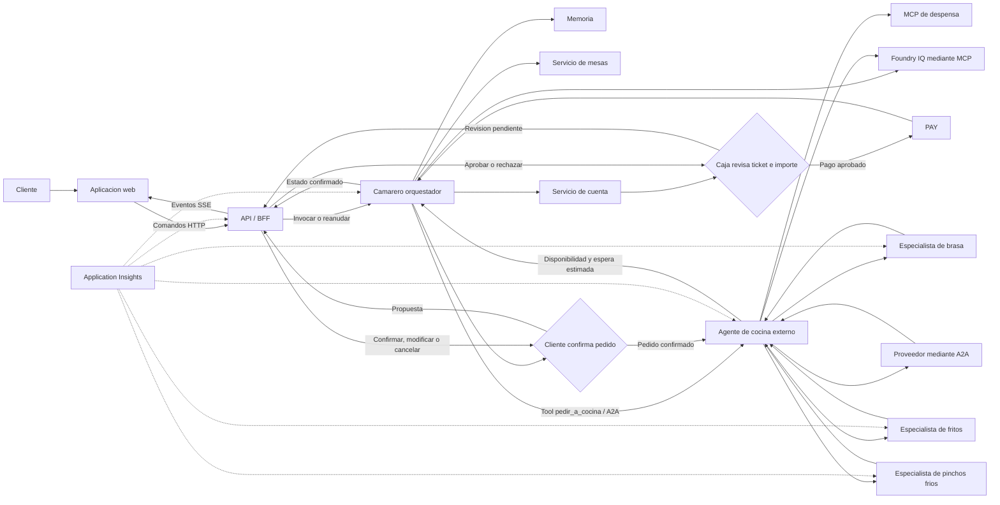

# Escenario reevaluado: restaurante multiagente

## 1. Objetivo de la demo

La demo debe explicar una arquitectura multiagente mediante una experiencia de
restaurante fácil de entender. El objetivo no es mostrar el mayor número posible
de agentes, sino enseñar cómo varios componentes colaboran con responsabilidades
claras, contexto compartido y datos verificables.

La primera demostración debe durar entre **3 y 5 minutos** y completar un
recorrido reconocible:

1. Un cliente entra en el restaurante.
2. El camarero obtiene su identidad y el número de comensales.
3. El sistema busca y asigna una mesa.
4. El cliente consulta la carta y propone un pedido.
5. La sesión se cierra y se abre de nuevo.
6. El camarero recupera el contexto y permite repetir o continuar el pedido.
7. El chef líder valida la disponibilidad, consulta a los especialistas y
   confirma al camarero el pedido viable con su tiempo de espera estimado.
8. El camarero presenta esa confirmación al cliente y solicita una confirmación
   explícita del pedido.
9. Tras la confirmación del cliente, cocina prepara y entrega el plato.
10. El cliente solicita la cuenta y el camarero la genera.
11. Caja reúne la petición original, el ticket, los consumos y los posibles
    cargos adicionales; una persona revisora aprueba o rechaza el importe antes
    de que el camarero coordine el pago simulado.
12. Después de un pago correcto, el cliente solicita liberar la mesa.

Después de este recorrido guiado, la aplicación puede quedar disponible para que
los asistentes la prueben mientras se explican la arquitectura, las llamadas
entre agentes, las herramientas y la observabilidad.

## 2. Principios de diseño

### Experiencia antes que complejidad

La historia principal debe funcionar de extremo a extremo antes de incorporar
variantes avanzadas. Cada capacidad técnica debe corresponder a algo visible en
la demo:

- Memoria: recordar automáticamente preferencias y restricciones de la identidad
  autenticada como contexto no vinculante entre visitas.
- Foundry IQ: consultar una base de conocimiento compartida sobre carta, recetas
  e ingredientes, conservando sus fuentes.
- MCP: consultar datos operativos como mesas o existencias.
- Multiagente: delegar la preparación del pedido en especialistas.
- A2A: invocar el agente de cocina externo y, posteriormente, solicitar
  productos a un proveedor externo.
- Human in the loop: una persona en caja revisa el ticket y el importe antes de
  completar el pago.
- Application Insights: explicar qué ocurrió y cuánto tardó cada paso.

### Eventos iniciados desde el frontal

Todas las acciones del recorrido se inician mediante eventos o invocaciones del
frontal. Esto incluye la llegada del cliente, los mensajes, la confirmación del
pedido, la solicitud de cuenta, la autorización del pago y la solicitud de
liberación de la mesa.

El frontal inicia la acción, pero no modifica directamente el estado de negocio.
El camarero recibe el evento, valida que la transición sea posible y coordina la
herramienta o servicio correspondiente. Cada invocación debe incluir un
identificador idempotente para que un reintento no genere dos cuentas, dos cobros
o dos liberaciones de la misma mesa. Toda la experiencia ocurre en una única
vista y bajo la identidad del cliente.

### Identidad de la demo local

En toda la demo, el nombre introducido al entrar en el restaurante es la única
identidad de cliente. El BFF lo normaliza y deriva de él el identificador estable
usado para la visita, conversación y memoria; no existe un segundo campo de
identidad en la interfaz ni un proveedor externo de identidad.

El navegador no incluye ese identificador derivado dentro de los comandos.
Después de entrar, el BFF conserva la identidad en su sesión y construye el
contexto de la sesión. Dos entradas con el mismo nombre normalizado representan
al mismo cliente durante la demo. Esta identidad sirve exclusivamente para
aislar las sesiones y los recursos simulados; no acredita una identidad real.

### Preguntar solo lo necesario

El camarero utiliza directamente los datos presentes en el mensaje o ya
disponibles en el contexto. Solo pregunta por los campos imprescindibles que
falten.

Ejemplos:

- «Hola, soy Majo y venimos dos» permite buscar mesa sin preguntas previas.
- Si no se indica el tamaño del grupo, `party_size` conserva el valor técnico
  por defecto `1`, pero el camarero pregunta si el cliente ha venido solo o
  acompañado. Ese valor por defecto no equivale a una confirmación.
- Si ha venido solo, el camarero consulta primero la disponibilidad y ofrece
  únicamente mesa, barra o ambas según la respuesta real. Al elegir una opción,
  la bloquea y confirma inmediatamente, sin una segunda aprobación.
- Si viene acompañado, pregunta cuántos son en total, bloquea una mesa
  compatible y espera la confirmación o rechazo explícitos del grupo.
- Un recuerdo puede sugerirse o solicitarse para reconfirmación, pero nunca debe
  reemplazar una indicación actual.

### Autoridad limitada

Cada agente o herramienta responde únicamente sobre su dominio:

- El camarero conversa, recopila datos y coordina.
- El servicio de mesas determina la disponibilidad real.
- La base de conocimiento de Foundry IQ responde sobre carta, recetas,
  ingredientes y alérgenos con fuentes.
- La despensa informa de existencias.
- Cocina decide si puede preparar la comanda.
- El proveedor confirma si puede suministrar un producto.
- El servicio de cuenta calcula importes exactos.
- El proveedor de pago confirma el resultado del cobro.
- El servicio de mesas cambia la ocupación cuando el camarero procesa una
  solicitud válida de liberación del cliente.

Ningún agente debe inventar datos que pertenecen a otro sistema.

### Arquitectura explicable

El contexto debe pasar por pasos explícitos y observables. La audiencia debe
poder distinguir entre:

- conversación;
- estado de la sesión;
- memoria persistente;
- conocimiento documental;
- estado operacional;
- delegación entre agentes;
- efectos reales, como reservar una mesa o crear una cuenta.

### Evolucion modular acordada el 1 de octubre de 2026

Recepcion/mesas, carta/conocimiento, cocina y cobro mantienen autoridad y
contratos propios. Cocina es ademas una frontera de despliegue: el camarero la
invoca mediante la tool `pedir_a_cocina`, que realiza una llamada A2A al agente
de cocina externo. El camarero no conoce ni invoca directamente al chef o a sus
especialistas.

El chef lider y los tres especialistas comparten inicialmente el despliegue de
cocina. Su coordinacion interna puede usar fan-out/fan-in o evaluar un group
chat, siempre que el chef siga siendo la unica autoridad de consolidacion y se
conserven contratos tipados, limites, timeouts y validacion determinista.
Separar los especialistas se reserva para una necesidad demostrada de escalado,
aislamiento, ciclo de vida o propiedad.

La primera entrega de cocina no consulta inventario: demuestra el traspaso del
pedido al chef, su contraste con carta, recetas, ingredientes y restricciones,
y la devolucion de un plan explicito. La despensa se incorpora posteriormente
como estado operacional mediante MCP.

## 3. Experiencia principal

La interfaz se centra en una **caja de texto**. Debajo se muestran las mesas
virtuales y su estado, de forma que la ocupación del restaurante cambie a medida
que entran clientes.

Estados mínimos de una mesa:

- libre;
- bloqueada temporalmente, pendiente de confirmación del cliente;
- ocupada;
- pendiente de confirmación del pedido;
- pendiente de cuenta;
- cuenta pendiente de confirmación;
- pago en curso;
- pagada;
- libre.

La interfaz puede incorporar información secundaria, pero no debe competir con
la conversación. Para el primer incremento basta con:

- historial de mensajes;
- caja de texto;
- identificación visible del cliente;
- mesas virtuales;
- pedido actual;
- estado breve del proceso.

El frontal también ofrece acciones contextuales que generan eventos:

- confirmar, modificar o cancelar el pedido;
- solicitar cuenta;
- confirmar o cancelar el pago;
- liberar mesa.

Las acciones solo se habilitan cuando corresponden al estado actual. La
confirmación visual se muestra después de que el camarero haya procesado la
invocación, no de forma optimista antes de conocer el resultado.

El servicio único de mesas evalúa la capacidad y crea un bloqueo temporal
atómico para el grupo. Si dos llegadas compiten por la última mesa compatible,
solo una obtiene el bloqueo; la otra recibe que no hay disponibilidad. Una mesa
solo la ocupa un grupo (una visita): bloqueada u ocupada, no está disponible
para otro grupo aunque le queden sillas libres. Se elige la mesa libre más
pequeña en la que cabe el grupo. El camarero bloquea en cuanto el cliente dice
cuántos son o pide mesa o barra; si no queda mesa, ofrece la barra. La vista
muestra la propuesta con el sitio y los asientos, y el cliente la confirma o la
rechaza con dos botones: una frase del chat nunca la confirma. Confirmar la
convierte en ocupación; rechazarla la libera al momento y dejarla caducar
también la libera. Una confirmación tardía recibe un aviso de caducidad. La
confirmación es una decisión explícita de negocio, no el punto HITL principal
de la demo. El camarero es el único cliente del servicio de mesas: pide la
confirmación y el BFF
persiste y presenta la decisión pendiente, y la respuesta de los botones
vuelve al camarero, que confirma o libera el bloqueo. Si el cliente escribe en
lugar de pulsar un botón, el sitio sigue reservado y el camarero vuelve a
pedir la confirmación con los botones. Una
cola visible de llegadas puede añadirse a la interfaz, pero no participa en la
decisión de concurrencia y se pospone si no aporta valor al recorrido
funcional.

El servicio trata mesas y puestos de barra como recursos de asiento. La barra
asigna puestos individuales contiguos al grupo y elige la propuesta que deja el
menor hueco posible y, a igualdad, la posición más baja: en una barra vacía los
grupos se sientan en orden, sin dejar huecos. El cliente también puede pedir
sentarse en la barra directamente. Su distribución llega mediante configuración
de entorno como JSON e ID; no obliga a reconstruir la imagen. Al arrancar, la
aplicación reinicializa exclusivamente sus datos de asientos cuando cambia el
ID. Cambiar el JSON manteniendo el ID conserva la distribución persistida.

La vista técnica puede mostrarse durante la explicación posterior y presentar:

- agente activo;
- paso actual;
- llamadas a herramientas;
- transferencia de contexto;
- `conversation_id`, `order_id` y `trace_id`;
- latencia y errores;
- eventos enviados a Application Insights.

### Integración técnica del frontal

El navegador no invoca directamente Microsoft Foundry, los agentes, MCP ni el
proveedor de pago. Se conecta a una API/BFF que actúa como frontera de seguridad
y adaptación entre la experiencia web y el workflow.

Para la demo se recomienda un modelo sencillo:

- **HTTP para comandos:** el frontal envía mensajes y acciones explícitas.
- **SSE para actualizaciones:** el BFF transmite cambios de estado, respuestas
  parciales y solicitudes de aprobación. SSE es suficiente porque las acciones
  del usuario ya viajan por HTTP y simplifica la reconexión respecto a un
  WebSocket bidireccional.
- **Consulta de snapshot:** al abrir o recargar la página, el frontal recupera el
  estado confirmado de la conversación, mesa, pedido, cuenta y workflow.

El frontal inicia comandos de negocio, pero no cada invocación interna. Por
ejemplo, `order.submitted` inicia la atención del pedido; a partir de ahí el
camarero y el líder de cocina coordinan memoria, Foundry IQ, MCP, especialistas y A2A
sin que la interfaz conozca esos detalles.

Comandos mínimos del frontal:

| Comando | Vista que lo emite | Resultado esperado |
|---|---|---|
| `customer.arrived` | Cliente | Sesión creada y búsqueda de mesa |
| `conversation.message_sent` | Cliente | Respuesta del camarero y estado actualizado |
| `memory.read_requested` | Cliente | Recuerdos de la identidad propia |
| `memory.correction_requested` | Cliente | Recuerdo propio corregido |
| `memory.deletion_requested` | Cliente | Recuerdo propio eliminado |
| `memory.clear_requested` | Cliente | Todos los recuerdos propios eliminados; guardado futuro automático |
| `table.confirmation_decided` | Cliente | Propuesta de mesa o barra confirmada (ocupada) o rechazada (libre) |
| `order.submitted` | Cliente | Propuesta enviada a cocina para validación |
| `order.confirmation_decided` | Cliente | Pedido confirmado, modificado o cancelado |
| `bill.requested` | Cliente | Cuenta generada y pago pendiente de confirmación |
| `payment.confirmation_decided` | Cliente | Pago autorizado o cancelado |
| `table.release_requested` | Cliente | Mesa liberada si el pago está confirmado |

En 3A el contrato público se limita a llegada, mensaje y los cuatro comandos
de memoria anteriores. La llegada solo abre o recupera la visita; la asignación
de mesa y los comandos restantes se incorporan en fase 4. La fase 4 empieza
por `table.confirmation_decided`, que decide la propuesta de mesa o barra
pendiente con su identificador y versión. No hay comandos ni
API de concesión o revocación: `memory.consent_granted` y
`memory.consent_revoked` se rechazan, no se ignoran ni se traducen a borrado.

Cada comando utiliza un sobre común versionado. Este ejemplo ilustra un
comando de cuenta futuro (fase 4), no el alcance inicial de 3A:

```json
{
  "schema_version": 1,
  "event_id": "evt_...",
  "event_type": "bill.requested",
  "occurred_at": "2026-09-24T11:28:00Z",
  "conversation_id": "conv_...",
  "payload": {}
}
```

La identidad no forma parte del comando: el servidor construye el contexto
autenticado y resuelve la pertenencia de los recursos. No acepta `actor`,
`actor_id` ni `authenticated` enviados por el cliente como identidad.

El BFF debe:

- autenticar al cliente y comprobar que la sesión, mesa, pedido y cuenta le
  pertenecen;
- generar o validar `event_id`, correlación e idempotencia;
- rechazar transiciones incompatibles con el estado actual;
- invocar o reanudar el workflow correspondiente;
- persistir el resultado antes de confirmarlo al navegador;
- publicar por SSE solo estados confirmados;
- permitir reconexión mediante el último identificador de evento.

El frontal no envía ni almacena datos de tarjeta. La integración de pago utiliza
el formulario o componente seguro del proveedor y entrega al BFF únicamente un
token o referencia de pago.

La interfaz mantiene una proyección visual del estado, no la fuente de verdad.
Después de una recarga debe reconstruirse desde el snapshot del backend. Si un
comando queda pendiente, el frontal muestra ese estado y evita enviarlo de nuevo
sin conservar la misma clave de idempotencia.

La aplicación ofrece una única vista de cliente. Tras identificarse, el usuario
entra en el restaurante y completa desde esa misma pantalla todo el recorrido:
mesa, conversación, pedido, confirmaciones, cuenta, pago y liberación.

El modo para asistentes debe utilizar sesiones aisladas y pagos simulados. Cada
cliente solo puede consultar o modificar su propia sesión, pedido, cuenta y mesa.

## 4. Guion de la demostración

### Escena 1: entrada y asignación de mesa

Mensaje de ejemplo:

> Hola, soy Majo y venimos dos.

El camarero detecta que ya dispone de nombre presentado y número de comensales.
El BFF usa el nombre de entrada como identidad local de demostración y el
camarero consulta la disponibilidad. El servicio bloquea una mesa compatible;
la interfaz muestra la propuesta con los botones «Confirmar» y «Rechazar» y el
cliente la confirma. Solo entonces la mesa cambia de bloqueada a ocupada, los
acompañantes aparecen tras el cliente y el grupo se sienta. Si otro cliente
pide mesa a la vez, recibe otra libre; si no quedan mesas, se le ofrece la
barra.

Variante para demostrar recopilación selectiva:

> Hola, queremos comer.

En este caso, el camarero pregunta únicamente por los datos que faltan antes de
consultar mesas.

### Escena 2: consulta y pedido

El cliente pregunta por la carta o por un plato. La información descriptiva
procede de la base compartida de Foundry IQ. Antes de aceptar el pedido, la disponibilidad
real de ingredientes procede de la despensa.

Ejemplo:

> ¿Qué tenéis típico de Burgos? Quiero una morcilla y agua con gas.

El camarero construye un borrador estructurado del pedido y muestra un resumen
comprensible para el cliente. La comanda definitiva todavía no se crea.

### Escena 3: cierre y recuperación

Se cierra la conversación y se abre una sesión nueva con la misma identidad. El
camarero recupera automáticamente las preferencias y restricciones propias, diferenciadas
por categoría y siempre como contexto no vinculante.

Ejemplo:

> ¿Puedo repetir lo de antes?

El sistema recuerda la preferencia por agua con gas, una posible restricción o
pedidos anteriores, pero vuelve a comprobar carta y existencias. Una restricción
recordada se reconfirma en la visita actual. La memoria nunca se utiliza como
prueba de disponibilidad ni como confirmación del pedido.

### Escena 4: preparación y entrega

El camarero transfiere el borrador al líder de cocina. El líder valida la
disponibilidad en la despensa y distribuye las elaboraciones entre los
especialistas. Cada especialista responde si acepta su parte y cuánto tardará.

Con esas respuestas, el chef líder consolida los productos disponibles, los
rechazos, las sustituciones y el tiempo de espera estimado del pedido completo.
El chef líder confirma ese resultado al camarero. Solo entonces el camarero
presenta al cliente el pedido definitivo y el tiempo estimado.

El workflow se pausa hasta que el cliente decide desde la misma vista:

- **Confirmar:** se crea la comanda definitiva y comienza la preparación.
- **Modificar:** el cambio vuelve a cocina y se genera una nueva propuesta que
  requiere otra confirmación.
- **Cancelar:** no se crea la comanda y el cliente puede empezar otro pedido.

Esta es una decisión explícita de negocio del cliente, no el HITL diferenciado
de la demo. Ningún plato comienza a prepararse sin esa confirmación.

Tras la aprobación, la interfaz muestra una progresión sencilla:

`pedido confirmado -> en cocina -> preparado -> entregado`

### Escena 5: cuenta, pago y liberación de mesa

El frontal emite una solicitud de cuenta. El camarero valida que el pedido esté
entregado, invoca el servicio de cuenta, presenta el desglose de los elementos
confirmados y pausa el workflow antes del cobro.

El sistema reúne la petición original, el ticket, los consumos y los posibles
cargos adicionales. Una persona revisora de caja decide sobre esa versión:

- **Aprobar:** el camarero envía el importe y la referencia al proveedor de
  pago simulado.
- **Rechazar:** no se realiza ningún cobro y la cuenta permanece pendiente para
  su corrección o revisión.

Este es el human in the loop diferenciado de la demo. El proveedor comunica si
el pago ha sido aprobado, rechazado o requiere un nuevo intento.

Después de un pago correcto se habilita la acción **Liberar mesa**. El cliente la
ejecuta, el camarero comprueba que la cuenta esté pagada, solicita la liberación
al servicio de mesas y confirma que vuelve a estar libre.

## 5. Arquitectura objetivo



### Camarero orquestador

Es el único agente que conversa directamente con el cliente.

Responsabilidades:

- identificar al cliente o tratarlo como invitado;
- extraer número de comensales y petición del mensaje, sin sustituir la
  identidad resuelta por el servidor. En la web, el nombre presentado llega
  fijado desde la entrada: el camarero lo usa, no lo pregunta y un nombre dicho
  en el chat no lo cambia. Solo la CLI de desarrollo lo extrae del mensaje;
- solicitar únicamente la información obligatoria que falte;
- consultar y comunicar la mesa asignada;
- recuperar y guardar automáticamente memoria de la identidad autenticada,
  diferenciando preferencias y restricciones
  pendientes de reconfirmación;
- responder sobre la carta utilizando la base de conocimiento compartida y sus
  fuentes;
- construir un borrador estructurado del pedido;
- transferir el contexto relevante a cocina;
- presentar al cliente la propuesta final de cocina y esperar su confirmación
  explícita;
- comunicar el estado y la entrega;
- generar la cuenta cuando el frontal lo solicite;
- presentar la cuenta y enviar a caja el ticket, la petición original, los
  consumos y los cargos adicionales para revisión humana;
- iniciar el cobro mediante el proveedor correspondiente;
- mantener la mesa ocupada hasta que el cliente solicite liberarla;
- liberar la mesa únicamente después de validar que el pago está confirmado.

El camarero no decide por sí mismo si hay mesa, si existe stock o si un plato
puede prepararse. Tampoco calcula importes ni da un pago por confirmado sin la
respuesta de los servicios correspondientes.

### Líder de cocina

Recibe una comanda estructurada y coordina su preparación:

- valida que los productos pertenezcan a la carta consultando la misma base de
  conocimiento que el camarero;
- consulta recetas e ingredientes en Foundry IQ;
- divide el pedido por categoría;
- delega en los especialistas adecuados;
- solicita a cada especialista aceptación y tiempo estimado;
- consolida disponibilidad, tiempos, rechazos y sustituciones;
- recurre al proveedor cuando falte un producto y la espera sea compatible con
  la demo;
- confirma al camarero el pedido viable y el tiempo de espera estimado.

`pedir_a_cocina` es una tool del camarero y un adaptador A2A: envía una comanda
minima y tipada al agente de cocina externo y convierte su respuesta en el
resultado estructurado que valida la aplicacion. El chef coordina mediante
group chat los especialistas de parrilla, fritos y general. Temporalmente todos
aceptan las tareas asignadas, pero una negativa o respuesta ausente ya impide
que el chef confirme esa línea. Cocina v1 todavia no consulta inventario ni
despensa.

La confirmación de cocina utiliza un contrato estructurado:

```text
accepted_items
rejected_items
substitutions
estimated_ready_minutes
reason
```

El tiempo comunicado al cliente procede de las estimaciones de los especialistas
y de la consolidación del chef líder; el camarero no lo calcula ni lo inventa.

### Especialistas de cocina

La primera versión multiagente contempla tres especialidades:

- brasa;
- fritos;
- pinchos fríos.

Todos utilizan el mismo contrato de salida:

```text
accepted
rejected
estimated_minutes
reason
substitution
```

No conversan con el cliente ni necesitan hablar entre ellos. El líder de cocina
es el único punto de coordinación. En la primera topologia multiagente viven en
el mismo despliegue externo que el chef, separados del camarero por la frontera
A2A. Siguen siendo componentes separados por contrato aunque compartan el
proceso de cocina.

### Proveedor mediante A2A

A2A se reserva para una frontera arquitectónica real. Si falta un ingrediente,
el líder de cocina puede consultar a un agente proveedor desplegado y gestionado
de forma independiente.

El proveedor devuelve disponibilidad, cantidad y tiempo estimado. Si no puede
atender la solicitud, cocina rechaza el plato o propone una alternativa. El flujo
principal debe poder ejecutarse aunque esta integración se desactive.

La interacción con el proveedor es una operación interna de cocina y no añade un
checkpoint humano. Su resultado se incorpora a la propuesta final que el
camarero presenta al cliente. Es el cliente quien confirma o rechaza el pedido
completo después de conocer la disponibilidad, sustituciones y tiempo estimado.

## 6. Separación de datos y capacidades

| Necesidad | Fuente correcta | Motivo |
|---|---|---|
| Pedido en curso | Estado de sesión | Cambia durante la conversación |
| Preferencias y restricciones de la identidad autenticada | Memoria persistente automática | Sobreviven a una sesión como contexto no vinculante y diferenciado |
| Pedidos anteriores | Historial | Permite repetir sin confundirlo con stock |
| Carta, recetas, ingredientes y alérgenos | Base compartida de Foundry IQ accesible mediante MCP | Información descriptiva con fuentes reutilizable por camarero y chef |
| Mesas disponibles | Servicio operacional o MCP | Estado que cambia en tiempo real |
| Existencias de despensa | MCP | Estado operacional verificable |
| Suministro externo | A2A | Capacidad de otro sistema o agente |
| Confirmación del pedido | Decisión explícita del cliente | Autoriza crear la comanda definitiva sin presentarse como HITL diferenciado |
| Cuenta | Servicio determinista | Requiere importes y líneas exactas |
| Revisión de ticket e importe | Human in the loop de caja | Una persona aprueba o rechaza antes del cobro |
| Pago | Proveedor de pago | Confirma el resultado y devuelve una referencia verificable |
| Liberación de mesa | Servicio operacional o MCP | Solo procede tras un pago confirmado |

### Conocimiento compartido del restaurante

La primera versión utiliza una única base de conocimiento de dominio en
Foundry IQ, accesible mediante MCP y reutilizada por el camarero y el chef. Se
mantiene deliberadamente sencilla y puede comenzar con una carta estática:

```text
knowledge/
  menu/
  recipes/
  ingredients/
```

La carta describe qué se ofrece; las recetas detallan preparación e
ingredientes; la despensa confirma mediante MCP si todavía puede prepararse.
Cada respuesta conserva la fuente utilizada. Los menús diarios, la separación
entre laborables y fin de semana o varios contenedores son evoluciones futuras,
no requisitos de la primera versión.

Cuando carta, recetario e ingredientes no contengan evidencia suficiente para
la consulta, la recuperacion debe intentar automaticamente la busqueda web como
fallback, sin exigir que el usuario lo solicite. Debe identificar la fuente
externa y no mezclarla con la carta oficial ni utilizarla para declarar
alergenos de la casa, stock, precio o disponibilidad. Si las fuentes de la casa
ya responden suficientemente, la web no es necesaria.

### Memoria

Se distinguen tres niveles:

1. **Sesión:** mesa, comensales y pedido actual.
2. **Historial:** visitas y pedidos finalizados.
3. **Memoria persistente:** preferencias y restricciones guardadas
   automáticamente con procedencia y fecha, diferenciadas por categoría.

El camarero lee y guarda recuerdos automáticamente para la identidad
autenticada resuelta por el servidor, incluida la identidad falsa de desarrollo
local. El nombre presentado en el chat no permite elegir un perfil ni acredita
autenticación. Los invitados no tienen perfil duradero. Se conservan el
aislamiento entre identidades y la validación de pertenencia en cada operación.
No existe estado de consentimiento en `MemoryView` ni en el snapshot interno.

El cliente puede consultar, corregir y borrar recuerdos individuales o todos
los recuerdos. `/memory clear` en la CLI equivale a olvidar los recuerdos
existentes, no a una revocación permanente: las interacciones futuras siguen
guardándose automáticamente. Los comandos antiguos de alta y revocación se
rechazan. Una corrección o eliminación debe reflejarse en las conversaciones
activas y después de reiniciar sin recuperar el dato antiguo desde el contexto.
El borrado total afecta solo a preferencias y restricciones: no modifica
visita, borrador ni `completed_order_history`. La gestión explícita se ofrece
mediante CLI/administración y contratos públicos; no se han incorporado
herramientas para ejecutar borrados mediante frases de chat como «olvida eso».

La migración SQLite elimina el acoplamiento al consentimiento en una
transacción, preservando recuerdos existentes, contadores e historial.
Nunca restaura recuerdos previamente eliminados, tampoco desde tablas antiguas.
En instalaciones locales existentes se elimina `DEV_FAKE_MEMORY_CONSENT` del
`.env` y se regenera el entorno con `./scripts/init-local-env.sh --force`;
la antigua variable exportada ya no se necesita.

Mientras un pedido siga siendo borrador, sus productos pueden resumirse como
una preferencia de pedido de largo plazo para la identidad autenticada. El resumen
omite cantidades y estado operacional, es no vinculante y no convierte el
borrador en historial ni demuestra que el cliente consumiera esos productos.
La respuesta estructurada expone estos recuerdos en un campo separado del
estado actual para que el cliente pueda comprobar qué se persistió realmente.
Cuando el cliente expresa intención de repetir su pedido habitual —por ejemplo,
«lo de siempre»— el camarero reutiliza directamente la memoria solo cuando
existe un único pedido recordado. Si existen varios, los presenta ordenados por
frecuencia y recencia y pregunta de forma natural cuál prefiere antes de crear
el borrador. El orden se calcula internamente: nunca se revelan al cliente
frecuencias, contadores ni recencia. Esto evita inferir una opción ambigua y no
confirma la comanda ni reafirma restricciones recordadas.
Las combinaciones solapadas se consolidan semánticamente a nivel de producto:
el camarero contrapone alternativas equivalentes una sola vez y pregunta por
separado si el cliente desea los complementos opcionales.
La memoria se acota de forma determinista: existe una cuota independiente para
preferencias y restricciones. Se conservan varios resúmenes de pedidos dentro
de la cuota de preferencias, un resumen idéntico se actualiza sin duplicarse y
acumula un contador de repeticiones. No se utiliza un LLM para resumir
restricciones.

Las preferencias incluyen tanto pedidos habituales como preferencias de asiento
expresadas por el cliente, por ejemplo mesa o barra. Recordar una preferencia de
asiento no reserva un recurso ni evita consultar disponibilidad: se presenta
como contexto no vinculante y la eleccion actual prevalece. Debe probarse su
recuperacion en una sesion nueva para la misma identidad normalizada, tanto en
el flujo individual como en el de grupos, junto con pruebas negativas entre
identidades.

Todos los recuerdos son contexto no vinculante. Las alergias y restricciones
recordadas deben reconfirmarse en la visita actual y nunca se consideran
vigentes únicamente por proceder de una visita anterior. Una instrucción actual
siempre prevalece sobre un recuerdo y el pedido requiere confirmación explícita.

## 7. Secuencia de orquestación

El recorrido principal es secuencial y fácil de seguir. Cada bloque comienza con
un evento o una invocación procedente del frontal:

1. El frontal envía el evento de llegada o el mensaje al camarero.
2. El camarero combina mensaje, sesión y memoria propia recuperada automáticamente sin convertir los
   recuerdos en instrucciones vigentes.
3. Si faltan datos obligatorios o una restricción recordada requiere
   reconfirmación, los solicita y pausa el flujo.
4. Para una persona, el camarero consulta los tipos disponibles y ocupa
   inmediatamente la opción que el cliente elige; para grupos, el servicio
   bloquea atómicamente una mesa compatible y espera la confirmación o rechazo
   antes de ocuparla.
5. La base compartida de Foundry IQ resuelve las consultas sobre carta, recetas
   e ingredientes y devuelve sus fuentes; si estas no contienen evidencia
   suficiente, intenta automaticamente la búsqueda web como fallback
   identificado.
6. El camarero construye el borrador de la comanda.
7. La tool `pedir_a_cocina` envía la comanda tipada mediante A2A al agente de
   cocina externo.
8. En Cocina v1, el líder contrasta el pedido con carta, recetas, ingredientes
   y restricciones y devuelve un plan tipado por A2A, sin consultar inventario.
9. En el incremento multiagente, el líder distribuye tareas entre especialistas
   internos, que pueden trabajar en paralelo, y consolida sus respuestas.
10. Cuando se incorpore despensa, el líder la consulta mediante MCP.
11. Si entonces falta un producto, el líder puede consultar al agente proveedor
    mediante A2A.
12. El líder consolida disponibilidad, sustituciones y tiempos en una única
    propuesta.
13. La tool devuelve al camarero el resultado A2A validado.
14. El camarero presenta esa confirmación y espera una decisión explícita.
14. El cliente confirma, modifica o cancela el pedido desde el frontal.
15. Solo un pedido confirmado se prepara y entrega.
16. El cliente solicita la cuenta y el camarero invoca el cálculo determinista.
17. El camarero presenta la cuenta y reúne para caja la petición original, el
    ticket, los consumos y los posibles cargos adicionales.
18. El workflow pausa en el HITL de caja hasta que una persona aprueba o rechaza
    el importe.
19. Solo una aprobación humana válida y ligada a esa versión permite iniciar el
    cobro simulado.
20. Tras un pago confirmado, el cliente solicita liberar la mesa.
21. El camarero valida el pago y libera la mesa.

Este diseño permite enseñar secuencia, delegación y paralelismo sin convertir la
demo en una conversación libre entre agentes. El camarero no inicia por sí mismo
ninguna transición de negocio: reacciona a eventos explícitos del frontal.

## 8. Observabilidad

Cada interacción debe compartir identificadores correlacionados:

- `conversation_id`;
- `customer_id`, cuando exista;
- `table_id`;
- `order_id`;
- `order_confirmation_id`, cuando exista;
- `bill_id`;
- `payment_confirmation_id`, cuando exista;
- `payment_id`, cuando exista;
- `frontend_event_id`;
- `trace_id`.

La traza debe permitir localizar:

- mensaje recibido;
- datos extraídos y campos pendientes;
- lectura/escritura de memoria propia, categoría, procedencia y reconfirmación;
- consulta de carta;
- consulta y asignación de mesa;
- transferencia del camarero a cocina;
- consulta MCP de despensa;
- trabajo de cada especialista;
- llamada A2A al proveedor, si se produce;
- consolidación y estado del pedido;
- confirmación del chef líder al camarero con disponibilidad y espera estimada;
- propuesta final de cocina;
- decisión explícita del cliente sobre el pedido;
- entrega y generación de la cuenta;
- pausa y decisión HITL de caja sobre el ticket y el importe;
- solicitud y resultado del cobro;
- solicitud del cliente para liberar la mesa;
- liberación de la mesa;
- latencia, error y reintentos de cada paso.

Durante la charla se pueden utilizar capturas estables de Application Insights
para evitar depender de la navegación en directo. La explicación debe relacionar
esas trazas con la definición de agentes y con lo que el público acaba de ver.

## 9. Implementación incremental

La arquitectura objetivo no debe construirse de una sola vez. El orden revisado
prioriza siempre un incremento demostrable.

### Contenedores y automatización de imágenes

Todo componente ejecutable de la demo debe ser contenedorable desde su propia
carpeta: frontend Streamlit, BFF FastAPI, agente/workflow cuando se ejecute como
contenedor, servidor MCP y proveedor A2A. Cada uno entrega un `Dockerfile`
reproducible y no depende de herramientas o archivos generados de una máquina
local.

Cada componente tiene además un workflow de GitHub Actions asociado a su ruta
que, ante `push`, construye y publica su imagen. El disparador usa filtros
`paths` para no ejecutar el workflow cuando cambian componentes ajenos; incluye
la ruta del componente, las dependencias compartidas que entren en su imagen
(por ejemplo `packages/contracts/`) y el propio archivo de workflow. Un cambio
en una dependencia compartida debe reconstruir todos los consumidores
afectados. La publicación no sustituye las pruebas: el workflow ejecuta las
validaciones del componente antes de publicar y etiqueta la imagen de manera
trazable con el commit. Todas las imágenes se publican en GitHub Packages
asociado a este repositorio; no se usa otro registro como destino del workflow.

### Incremento 1: camarero, memoria e interfaz mínima

- conversación de texto;
- API/BFF como único punto de entrada al workflow;
- comandos HTTP y actualizaciones mediante SSE;
- snapshot para recuperar el estado después de recargar;
- identidad opcional;
- extracción de datos proporcionados por el usuario;
- preguntas solo para datos ausentes;
- sesión y memoria persistente automática para identidades autenticadas;
- consulta, corrección y borrado individual o total de recuerdos;
- separación explícita entre preferencias y restricciones no vinculantes;
- recuperación tras cerrar y abrir;
- representación inicial de mesas, aunque utilice datos locales;
- frontend empaquetable y desplegable de forma independiente, con configuración
  por variables de entorno para distintos BFF y proyectos Foundry.
- todos los componentes ejecutables tienen su propio `Dockerfile` y un workflow
  de GitHub Actions que construye y publica su imagen al cambiar su ruta.

### Incremento 2: mesas y recorrido completo simulado

- disponibilidad y asignación deterministas, con bloqueo temporal atómico de
  plazas, confirmación o liberación y expiración;
- cambio visual del estado de las mesas;
- pedido estructurado;
- estados de preparación y entrega;
- confirmación explícita del cliente para confirmar, modificar o cancelar el
  pedido;
- cuenta con cálculo determinista;
- HITL de caja para aprobar o rechazar el ticket y el importe;
- pago simulado con resultado explícito;
- liberación de mesa solicitada por el cliente y coordinada por el camarero;
- eventos del frontal con claves de idempotencia;
- vista única para todo el recorrido del cliente.

Este incremento debe permitir ensayar ya los 3-5 minutos completos, aunque
algunas integraciones todavía sean locales.

Un gateway de modelos/agentes puede incorporarse como mejora opcional si queda
tiempo. No condiciona el recorrido principal ni sustituye al BFF: centraliza
eventualmente el acceso a modelos y agentes para explicarlo durante la demo.

### Incremento 3: conocimiento del restaurante y despensa

- carta estática inicial con fuentes;
- base compartida de Foundry IQ con documentos separados de carta, recetas e
  ingredientes;
- acceso mediante MCP para camarero y chef;
- búsqueda web de respaldo, identificada y sin autoridad operacional;
- MCP para existencias;
- separación verificable entre conocimiento y estado operacional.

### Incremento 4: cocina multiagente

- Cocina v1: tool del camarero y transferencia tipada mediante A2A a un agente
  de cocina externo;
- contraste con carta, recetario, ingredientes y restricciones mediante
  Foundry IQ, sin inventario;
- validacion determinista del plan y error explicito;
- siguiente incremento: especialistas de brasa, fritos y pinchos fríos dentro
  del mismo despliegue de cocina;
- distribución y consolidación interna, evaluando group chat solo si mantiene
  una unica autoridad y contratos observables;
- rechazo y sustitución explícitos;
- manejo de fallos parciales.

### Incremento 5: proveedor A2A

- agente proveedor independiente;
- contrato de solicitud y respuesta;
- resultado incorporado a la propuesta final de cocina;
- timeout y comportamiento cuando no está disponible;
- demostración opcional, sin bloquear el recorrido principal.

### Incremento 6: observabilidad y preparación pública

- trazas correlacionadas en Application Insights;
- capturas de respaldo para la presentación;
- acceso controlado para asistentes;
- datos reiniciables entre pruebas;
- límites de concurrencia, coste y duración;
- recorrido ensayado y plan de contingencia.

## 10. Criterios de aceptación de la demo

La demo se considera preparada cuando:

- completa el recorrido principal en menos de 5 minutos;
- pregunta solo por los datos obligatorios que falten;
- asigna una mesa con capacidad suficiente;
- refleja visualmente la ocupación;
- recupera contexto después de reiniciar la conversación;
- distingue recuerdos de instrucciones actuales y reconfirma las restricciones;
- lee y guarda automáticamente recuerdos de la identidad autenticada sin crear
  perfiles duraderos de invitados ni mezclar identidades;
- permite corregir y olvidar recuerdos sin bloquear escrituras futuras ni
  restaurar datos eliminados durante la migración o tras reiniciar;
- consulta la carta y la despensa desde fuentes diferentes;
- muestra al menos una transferencia del camarero a cocina;
- consolida la respuesta de los especialistas;
- obtiene de los especialistas la aceptación y el tiempo estimado;
- recibe del chef líder la confirmación de disponibilidad y el tiempo de espera;
- presenta al cliente el pedido final después de consultar a cocina;
- espera una decisión explícita del cliente para confirmar, modificar o cancelar;
- no prepara ningún plato antes de confirmar el pedido;
- entrega el plato y genera una cuenta exacta;
- presenta la cuenta y pausa el workflow en la revisión humana de caja;
- no inicia el cobro hasta que una persona aprueba el ticket y el importe;
- procesa el pago y conserva su referencia;
- mantiene la mesa ocupada hasta que el cliente solicite liberarla;
- libera la mesa solo después de comprobar que el pago está confirmado;
- inicia todas las transiciones mediante eventos o invocaciones del frontal;
- evita efectos duplicados al reintentar un evento;
- accede a los agentes únicamente mediante el BFF;
- reconstruye la interfaz desde un snapshot después de recargar;
- recibe por SSE estados confirmados y puede reconectarse sin perder eventos;
- completa todo el recorrido desde una única vista de cliente;
- permite seguir el recorrido mediante identificadores y trazas;
- dispone de un modo estable para que los asistentes realicen pruebas;
- puede ejecutar el camino feliz aunque A2A o una capacidad opcional falle.

## 11. Prioridades y riesgos

### Prioridad inmediata

Con Foundry IQ y Cocina v1 ya integrados, la prioridad inmediata es:

1. hacer automatico y verificable el fallback web cuando las fuentes de la
   casa no contengan los ingredientes solicitados;
2. verificar y corregir la recuperacion de preferencias de mesa/barra y pedidos
   habituales en sesiones nuevas;
3. validar conjuntamente la llamada A2A ya implementada y sustituir las
   aceptaciones temporales de los especialistas por decisiones reales, sin
   inventario en este incremento.

La validacion del Hosted Agent se aborda cuando este recorrido interno sea
estable. El inventario y la posible separacion de los especialistas en
despliegues propios son evoluciones posteriores, no bloqueos de Cocina v1.

### Riesgos principales

| Riesgo | Mitigación |
|---|---|
| La memoria intenta utilizar infraestructura no configurada | Mantener una implementación local desacoplada y activar el almacén gestionado por configuración |
| La demo acumula demasiados agentes y servicios | Hacer que A2A y capacidades avanzadas sean opcionales |
| El modelo pregunta datos ya proporcionados | Extraer primero los campos y pasar un estado estructurado al camarero |
| El conocimiento se usa para declarar disponibilidad | Separar Foundry IQ de mesas y despensa operacionales |
| Una integración externa falla en directo | Preparar datos locales, timeouts y capturas de observabilidad |
| El acceso del público altera el estado de la demo | Aislar sesiones y ofrecer un reinicio controlado |
| El frontal reintenta un evento y duplica un efecto | Exigir una clave de idempotencia y persistir el resultado de cada invocación |
| El navegador invoca directamente agentes o herramientas | Centralizar autenticación, autorización y orquestación en el BFF |
| La conexión SSE se interrumpe | Reconectar desde el último evento y reconstruir la vista desde un snapshot |
| El estado visual diverge del backend | Tratar el frontal como una proyección y mostrar solo transiciones confirmadas |
| Se prepara un pedido sin confirmación | Exigir un `order_confirmation_id` válido antes de crear la comanda definitiva |
| Se cobra sin revisión humana | Exigir un `payment_approval_id` válido y ligado a la versión exacta de la cuenta |
| Una confirmación se repite o llega tarde | Hacer idempotente la decisión y cerrar el checkpoint tras el primer resultado válido |
| Se libera una mesa antes del pago | Validar la máquina de estados y aceptar la liberación solo tras un pago confirmado |

## 12. Cadencia de validación

El trabajo se gestiona mediante una checklist y cambios pequeños revisables. Un
elemento solo se considera completado después de validar su comportamiento.

La cadencia recomendada es:

- completar uno o dos elementos de la checklist por día;
- mantener sincronizaciones breves para revisar avances y bloqueos;
- probar cada incremento antes de incorporar el siguiente;
- alcanzar una versión avanzada el **viernes 2 de octubre de 2026**;
- reservar la semana previa a la presentación para pruebas, ensayo y ajustes.

La checklist no asigna responsables: describe resultados verificables, estado y
criterios de aceptación.

## Mensaje central

Una buena arquitectura multiagente no consiste en añadir más agentes. Consiste en
asignar responsabilidades claras, transferir solo el contexto necesario,
consultar la fuente correcta para cada dato y poder explicar todo el recorrido
con evidencias.
