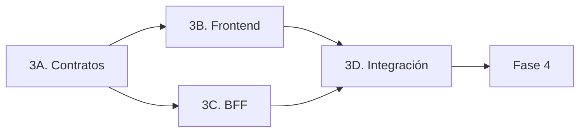

# Anexo: paralelización del frontend

## 1. Propósito

Este anexo detalla cómo ejecutar en paralelo el trabajo de frontend de la
[fase 3](../PLAN_IMPLEMENTACION.md#fase-3-una-vista-de-cliente-bff-y-continuidad)
sin alterar el orden de fases ni las fronteras de arquitectura definidas en el
plan.

La fase 3 sigue siendo una única unidad de aceptación. La paralelización reduce
su camino crítico, pero no permite considerar completada la fase hasta integrar
y validar conjuntamente Streamlit, BFF, identidad, comandos, eventos y
recuperación.

## 2. Principio de trabajo

El frontend se desarrolla contra el contrato público del BFF, no contra los
agentes, su transporte ni su persistencia interna.

Para desbloquear el trabajo visual antes de disponer del BFF completo, se
utilizará un cliente falso que implemente la misma interfaz que el cliente
HTTP/SSE definitivo:

- `FakeBffClient` devuelve snapshots, resultados de comandos y secuencias de
  eventos representativos;
- `HttpBffClient` consume el contrato real del BFF;
- la selección del adaptador es explícita mediante configuración;
- los datos simulados se identifican como tales y no se presentan como una
  integración real.

Se simula la frontera del BFF, no se importan ni se reproducen dentro del
frontend el workflow, los agentes o las reglas de negocio.

## 3. Carriles paralelos de la fase 3

| Carril | Alcance | Entrega |
|---|---|---|
| 3A. Contratos | Comandos, resultados, eventos, snapshot, estados, acciones permitidas y errores públicos | Contrato versionado y fixtures compartidos |
| 3B. Frontend | Vista Streamlit, proyección visual, acciones contextuales y adaptadores de cliente | Interfaz demostrable contra `FakeBffClient`, `Dockerfile` y workflow de imagen con filtros de ruta |
| 3C. BFF | FastAPI, identidad, autorización, idempotencia, persistencia de eventos, snapshot y SSE | API ejecutable contra el adaptador local del workflow, `Dockerfile` y workflow de imagen con filtros de ruta |
| 3D. Integración | Sustitución del cliente falso, continuidad y pruebas entre componentes | Primer corte vertical y criterios de fase 3 validados |

Los workflows de 3B y 3C se activan en `push` únicamente cuando cambian su
carpeta, sus dependencias compartidas incluidas en la imagen o su YAML. Cada uno
ejecuta las pruebas pertinentes antes de construir y publicar la imagen en
GitHub Packages de este repositorio; no se activa por cambios exclusivos de
otros componentes.

Los carriles 3B y 3C comienzan cuando existe una primera versión utilizable del
contrato. Pueden evolucionar en paralelo, pero cualquier cambio incompatible
del contrato debe integrarse primero y actualizar sus fixtures y pruebas antes
de modificar ambos consumidores.

## 4. Contrato mínimo para iniciar el frontend

El carril 3A debe acordar como mínimo:

- sobre común de comandos con `event_id`, tipo, versión y fecha; identidad
  validada separada y correlación generada por el servidor;
- resultado de comando con estados `pending`, `completed` y `failed`;
- snapshot de conversación, visita, cliente, borrador, memoria y proceso;
- lista explícita de `allowed_actions`;
- evento de stream con identificador, secuencia o cursor y estado confirmado;
- errores públicos distinguibles de fallos internos;
- comportamiento cuando el cursor SSE ha caducado;
- fixtures de camino feliz, estado pendiente, error, reconexión y ausencia de
  acciones permitidas.

Los comandos de 3A son llegada (`customer.arrived`), mensaje
(`conversation.message_sent`), `memory.read_requested`,
`memory.correction_requested`, `memory.deletion_requested` y
`memory.clear_requested`. La lectura y escritura de recuerdos es automática
para la identidad de demo que el BFF deriva del nombre de entrada. `MemoryView`
no expone
consentimiento y no hay controles de concesión o revocación; sus comandos
antiguos se rechazan, no se ignoran. La UI explica que borrar todos los
recuerdos no impide recordar interacciones futuras y mantiene las restricciones
recordadas separadas de las reafirmadas en la visita.

Los modelos compartidos viven en `packages/contracts/`. No deben depender de
Streamlit, FastAPI, Agent Framework ni de adaptadores de infraestructura.

La [versión inicial de 3A](../packages/contracts/README.md) está implementada con
pruebas y fixtures. No incluye todavía modelos de mesa, propuesta, cuenta, pago
ni HITL: se incorporarán con sus consumidores en fase 4. Los contratos no
constituyen una implementación de BFF ni de autenticación.

## 5. Alcance autónomo del frontend

El carril 3B puede implementar y probar:

1. identificación visible del cliente;
2. historial y caja de conversación;
3. representación de mesas con datos locales claramente etiquetados;
4. pedido actual y estado breve del proceso;
5. acciones contextuales derivadas de `allowed_actions`;
6. estados visuales de envío, pendiente, completado y error;
7. reconstrucción completa de la vista desde un snapshot;
8. conservación del mismo `event_id` al mostrar o reintentar una operación
   pendiente;
9. consumo de una secuencia simulada de eventos;
10. interfaz común para `FakeBffClient` y `HttpBffClient`.

También puede representar anticipadamente los estados visuales de la fase 4
mediante fixtures: confirmación del pedido, solicitud de cuenta, autorización
del pago y liberación de mesa. Esto no adelanta las reglas ni los efectos de
negocio, que permanecen en el dominio y los servicios deterministas.

El frontend no debe:

- invocar Foundry, MCP, A2A o agentes directamente;
- leer la base de datos o asumir su esquema;
- interpretar texto narrativo para deducir transiciones de negocio;
- habilitar acciones mediante reglas duplicadas en la interfaz;
- aplicar cambios optimistas sobre mesas, pedidos, cuentas o pagos;
- crear una nueva suscripción o reenviar un comando en cada rerun;
- sustituir SSE por sondeo sin una decisión explícita del plan.

## 6. Propiedad de archivos y coordinación

Para reducir conflictos entre trabajos paralelos:

| Superficie | Carril principal |
|---|---|
| `apps/frontend/` | 3B. Frontend |
| `apps/bff/` | 3C. BFF |
| `packages/contracts/` | 3A. Contratos |
| `packages/domain/` y workflow | Implementación principal, fuera del frontend |
| `tests/` de contrato e integración | 3D. Integración |

Los cambios en `packages/contracts/` deben ser pequeños, revisables y preceder a
los cambios que dependan de ellos. El carril de frontend no modifica prompts,
agentes ni reglas de dominio para adaptar la UI.

## 7. Hitos de integración

### Hito 1. Contrato demostrable

- modelos y fixtures compartidos disponibles;
- vista Streamlit navegable contra `FakeBffClient`;
- estados principales y errores representables;
- datos simulados identificados visualmente.

### Hito 2. Primer corte vertical

- un mensaje se envía mediante HTTP;
- el BFF devuelve un resultado correlacionado;
- Streamlit recibe actualizaciones por SSE;
- la vista puede reconstruirse mediante snapshot;
- un rerun o una reconexión no duplica el comando.

### Hito 3. Fase 3 integrada

- identidad resuelta por el servidor;
- visita activa persistida y recuperable;
- aislamiento de snapshot y eventos entre clientes;
- reconexión mediante cursor sin huecos;
- recuperación explícita mediante snapshot cuando el cursor caduca;
- memoria automática consultable, corregible y borrable (individual o
  totalmente) desde la vista, sin controles de consentimiento;
- pruebas de contrato e integración superadas.

Solo el hito 3 permite aplicar los criterios de aceptación de la fase 3.
Después de 3A se puede adelantar dominio y servicios deterministas de fase 4,
coordinando sus contratos nuevos, sin esperar al frontend. Su integración y
aceptación del recorrido completo siguen dependiendo de la fase 3.

## 8. Validación del trabajo paralelo

Cada cambio debe indicar:

- carril e hito al que contribuye;
- versión del contrato utilizada;
- si la evidencia procede de fixtures, del adaptador local o del BFF real;
- pruebas dirigidas ejecutadas;
- limitaciones y siguiente punto de integración.

La integración debe realizarse de forma continua mediante cortes verticales
pequeños. No se esperará a terminar por separado todo el frontend y todo el BFF
para conectarlos por primera vez.
